## SQL - Funkcje okna (Window functions) <br> Lab 1

---

**Imiona i nazwiska: Jan Małek** 

---

Celem ćwiczenia jest przygotowanie środowiska pracy, wstępne zapoznanie się z działaniem funkcji okna (window functions) w SQL, analiza wydajności zapytań i porównanie z rozwiązaniami przy wykorzystaniu "tradycyjnych" konstrukcji SQL

Swoje odpowiedzi wpisuj w miejsca oznaczone jako:

---

> Wyniki:

```sql
--  ...
```

---

Ważne/wymagane są komentarze.

Zamieść kod rozwiązania oraz zrzuty ekranu pokazujące wyniki, (dołącz kod rozwiązania w formie tekstowej/źródłowej)

Zwróć uwagę na formatowanie kodu

---

## Oprogramowanie - co jest potrzebne?

Do wykonania ćwiczenia potrzebne jest następujące oprogramowanie:

- MS SQL Server - wersja 2019, 2022, 2025
- PostgreSQL - wersja 15/16/17/18
- SQLite
- Narzędzia do komunikacji z bazą danych
  - SSMS - Microsoft SQL Managment Studio
  - DtataGrip lub DBeaver
- Przykładowa baza Northwind
  - W wersji dla każdego z wymienionych serwerów

Oprogramowanie dostępne jest na przygotowanej maszynie wirtualnej

## Dokumentacja/Literatura

- Kathi Kellenberger,  Clayton Groom, Ed Pollack, Expert T-SQL Window Functions in SQL Server 2019, Apres 2019
- Itzik Ben-Gan, T-SQL Window Functions: For Data Analysis and Beyond, Microsoft 2020

- Kilka linków do materiałów które mogą być pomocne
   - [https://learn.microsoft.com/en-us/sql/t-sql/queries/select-over-clause-transact-sql?view=sql-server-ver16](https://learn.microsoft.com/en-us/sql/t-sql/queries/select-over-clause-transact-sql?view=sql-server-ver16)
  - [https://www.sqlservertutorial.net/sql-server-window-functions/](https://www.sqlservertutorial.net/sql-server-window-functions/)
  - [https://www.sqlshack.com/use-window-functions-sql-server/](https://www.sqlshack.com/use-window-functions-sql-server/)
  - [https://www.postgresql.org/docs/current/tutorial-window.html](https://www.postgresql.org/docs/current/tutorial-window.html)
  - [https://www.postgresqltutorial.com/postgresql-window-function/](https://www.postgresqltutorial.com/postgresql-window-function/)
  - [https://www.sqlite.org/windowfunctions.html](https://www.sqlite.org/windowfunctions.html)
  - [https://www.sqlitetutorial.net/sqlite-window-functions/](https://www.sqlitetutorial.net/sqlite-window-functions/)

- W razie potrzeby - opis Ikonek używanych w graficznej prezentacji planu zapytania w SSMS jest tutaj:
  - [https://docs.microsoft.com/en-us/sql/relational-databases/showplan-logical-and-physical-operators-reference](https://docs.microsoft.com/en-us/sql/relational-databases/showplan-logical-and-physical-operators-reference)

## Przygotowanie

Uruchom SSMS
- Skonfiguruj połączenie z bazą Northwind na lokalnym serwerze MS SQL 

Uruchom DataGrip (lub Dbeaver)

- Skonfiguruj połączenia z bazą Northwind3
  - na lokalnym serwerze MS SQL
  - na lokalnym serwerze PostgreSQL
  - z lokalną bazą SQLite

---

# Zadanie 1 - obserwacja

Wykonaj i porównaj wyniki następujących poleceń.

```sql
select avg(unitprice) avgprice
from products p;

select avg(unitprice) over () as avgprice
from products p;

select categoryid, avg(unitprice) avgprice
from products p
group by categoryid

select avg(unitprice) over (partition by categoryid) as avgprice
from products p;
```

Jaka jest są podobieństwa, jakie różnice pomiędzy grupowaniem danych a działaniem funkcji okna?

---

> Wyniki:

```sql
Podobieństwa: Zarówno klauzula GROUP BY, jak i funkcje okna (OVER) pozwalają na wykonywanie funkcji agregujących, takich jak AVG(), na określonym zbiorze danych.

Różnice: Tradycyjne grupowanie (GROUP BY categoryid) agreguje wiersze, zwracając tylko jeden wiersz dla każdej unikalnej kategorii. Utracisz dostęp do detali pojedynczych produktów w tym samym zapytaniu.

Funkcja okna z OVER (PARTITION BY categoryid) oblicza średnią dla każdej kategorii, ale nie redukuje liczby wierszy w wyniku. Wynik agregacji jest dołączany jako nowa kolumna do każdego oryginalnego wiersza w tabeli products. Zapytanie z samym OVER() oblicza średnią dla całej tabeli i dołącza ją do każdego wiersza.
```

---

# Zadanie 2 - obserwacja

Wykonaj i porównaj wyniki następujących poleceń.

```sql
--1)

select p.productid, p.ProductName, p.unitprice,
       (select avg(unitprice) from products) as avgprice
from products p
where productid < 10

--2)
select p.productid, p.ProductName, p.unitprice,
       avg(unitprice) over () as avgprice
from products p
where productid < 10
```

Jaka jest różnica? Czego dotyczy warunek w każdym z przypadków? Napisz polecenie równoważne

- 1. z wykorzystaniem funkcji okna. Napisz polecenie równoważne
- 2. z wykorzystaniem podzapytania

---

> Wyniki:

```sql
W zapytaniu z funkcją okna funkcja agregująca avg(unitprice) over () jest obliczana po przefiltrowaniu danych przez klauzulę WHERE. Zatem oblicza ona średnią cenę tylko dla produktów, które spełniają warunek productid < 10.

W zapytaniu z podzapytaniem warunek WHERE productid < 10 filtruje tylko zewnętrzny wynik. Podzapytanie (select avg(unitprice) from products) oblicza średnią ze wszystkich produktów w bazie, niezależnie od warunku w głównym zapytaniu.

1)
WITH CTE AS (
    SELECT p.productid, p.ProductName, p.unitprice,
           avg(unitprice) over () as avgprice
    FROM products p
)
SELECT * FROM CTE WHERE productid < 10;

2) 
SELECT p.productid, p.ProductName, p.unitprice,
       (SELECT avg(unitprice) FROM products WHERE productid < 10) as avgprice
FROM products p
WHERE productid < 10;
```

---

# Zadanie 3

Baza: Northwind, tabela: products

Napisz polecenie, które zwraca: id produktu, nazwę produktu, cenę produktu, średnią cenę wszystkich produktów.

Napisz polecenie z wykorzystaniem z wykorzystaniem podzapytania, join'a oraz funkcji okna. Porównaj czasy oraz plany wykonania zapytań.

Przetestuj działanie w różnych SZBD (MS SQL Server, PostgreSql, SQLite)

W SSMS włącz dwie opcje: Include Actual Execution Plan oraz Include Live Query Statistics


W DataGrip użyj opcji Explain Plan/Explain Analyze


---

> Wyniki:

```sql
MS SQL
1. 77 rows retrieved starting from 1 in 367 ms (execution: 12 ms, fetching: 355 ms). Koszt 0.0041.
Plan:

```
1. 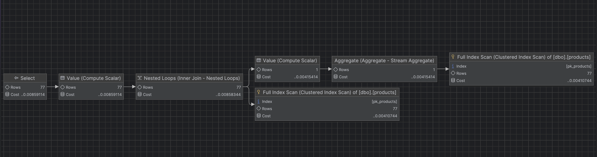

```sql
2. 77 rows retrieved starting from 1 in 384 ms (execution: 13 ms, fetching: 371 ms). Koszt 0.0041.
Plan:
```

2. 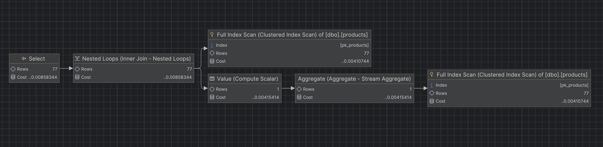

```sql
3. 77 rows retrieved starting from 1 in 354 ms (execution: 13 ms, fetching: 341 ms). Koszt 0.0041.
Plan:
```
3. 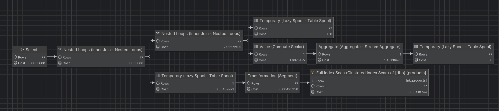

```sql
Postgres
1. 77 rows retrieved starting from 1 in 386 ms (execution: 16 ms, fetching: 370 ms)
Plan:
```
1. 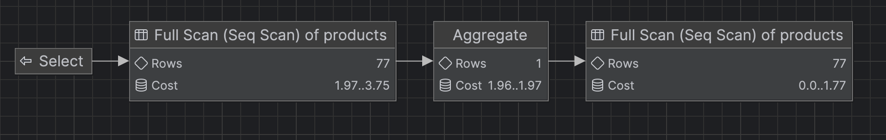

```sql
2. 77 rows retrieved starting from 1 in 343 ms (execution: 5 ms, fetching: 338 ms)
Plan:
```
2. 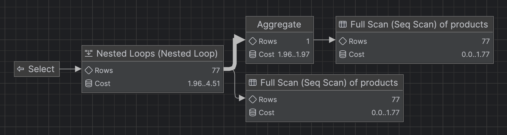

```sql
3. 77 rows retrieved starting from 1 in 339 ms (execution: 6 ms, fetching: 333 ms)
Plan:
```
3. 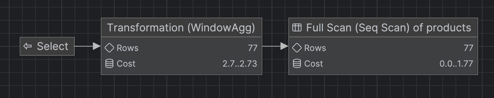
   
```sql
SQLite
1. 77 rows retrieved starting from 1 in 414 ms (execution: 17 ms, fetching: 397 ms). 
Plan:
```
1. 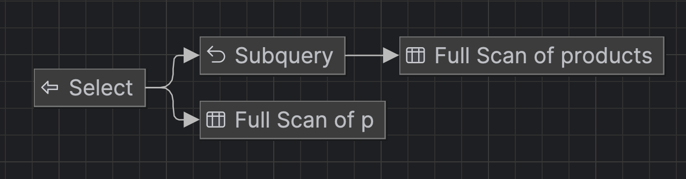
```sql
2. 77 rows retrieved starting from 1 in 372 ms (execution: 5 ms, fetching: 367 ms)
```
2. 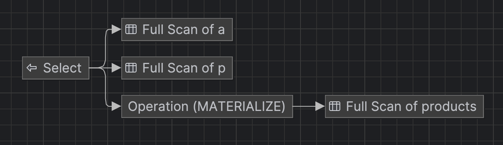
```sql
3. 77 rows retrieved starting from 1 in 358 ms (execution: 5 ms, fetching: 353 ms)
```
3. 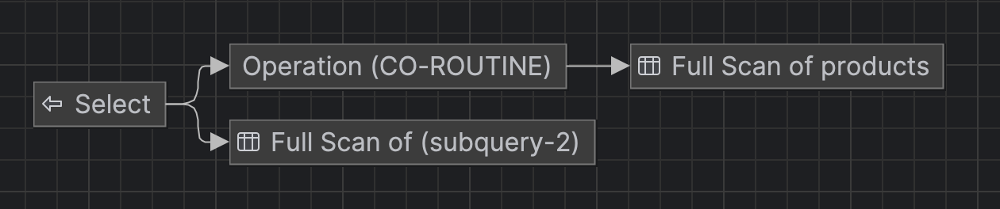
   
```sql
Analizując wyniki zapytań z Zadania 3 , można zauważyć interesujące różnice w sposobie optymalizacji kodu przez poszczególne systemy zarządzania bazami danych. Pod względem składni, polecenie wykorzystujące funkcję okna z klauzulą OVER jest zdecydowanie najkrótsze i najbardziej czytelne w porównaniu do konstrukcji z podzapytaniem czy złączeniem (JOIN). Porównując czasy oraz plany wykonania zapytań, optymalizator w MS SQL Server poradził sobie równie dobrze z każdym z trzech wariantów – wszystkie wygenerowały identyczny koszt całkowity (0.0041) oraz bardzo zbliżony czas samej egzekucji na poziomie 12-13 ms. Oznacza to, że silnik MS SQL skutecznie zoptymalizował podzapytanie, najprawdopodobniej wykonując agregację tylko raz. Sytuacja wygląda inaczej w przypadku PostgreSQL i SQLite, gdzie wyraźnie zarysowały się różnice wydajnościowe. W tych silnikach zapytanie oparte na podzapytaniu w klauzuli SELECT okazało się najwolniejsze (odpowiednio 16 ms i 17 ms czasu egzekucji), natomiast zastosowanie JOIN-a lub funkcji okna drastycznie poprawiło wynik, skracając czas wykonania do zaledwie 5-6 ms. Podsumowując, chociaż bardzo zaawansowane silniki potrafią zniwelować różnice wydajnościowe wynikające ze sposobu zapisu, stosowanie funkcji okna pozostaje najlepszą i najbezpieczniejszą praktyką, która gwarantuje optymalny czas wykonania niezależnie od używanego środowiska.
```

---


# Zadanie 4

Baza: Northwind, tabela products

Napisz polecenie, które zwraca: id produktu, nazwę produktu, cenę produktu, średnią cenę produktów w kategorii, do której należy dany produkt. Wyświetl tylko pozycje (produkty) których cena jest większa niż średnia cena.

Napisz polecenie z wykorzystaniem podzapytania, join'a oraz funkcji okna. Porównaj zapytania. Porównaj czasy oraz plany wykonania zapytań.

Przetestuj działanie w różnych SZBD (MS SQL Server, PostgreSql, SQLite)

---

> Wyniki:

```sql
SQL
1. 27 rows retrieved starting from 1 in 368 ms (execution: 27 ms, fetching: 341 ms)
Plan:
```
1. 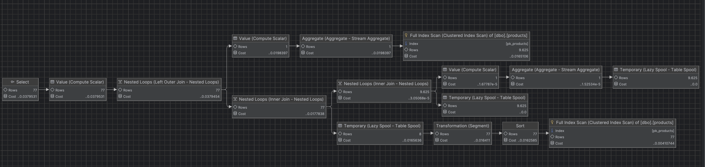
```sql
2. 27 rows retrieved starting from 1 in 349 ms (execution: 15 ms, fetching: 334 ms)
Plan:
```
2. 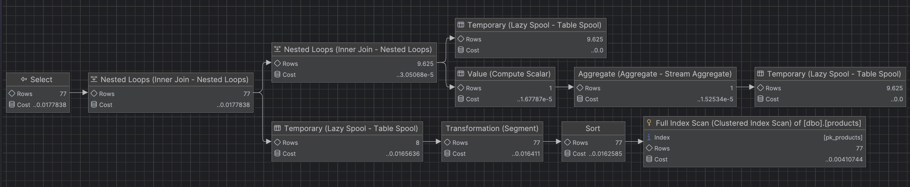
```sql
3. 27 rows retrieved starting from 1 in 350 ms (execution: 17 ms, fetching: 333 ms)
Plan:
```
3. 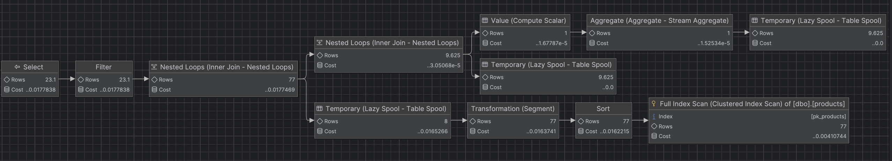

```sql
Postgres
1. 27 rows retrieved starting from 1 in 343 ms (execution: 7 ms, fetching: 336 ms)
Plan:
```
1. 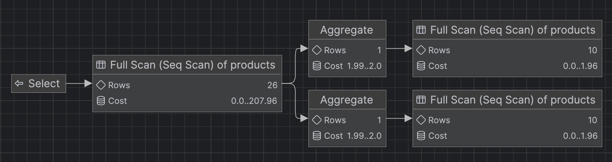

```sql
2. 27 rows retrieved starting from 1 in 338 ms (execution: 6 ms, fetching: 332 ms)
Plan:
```
2. 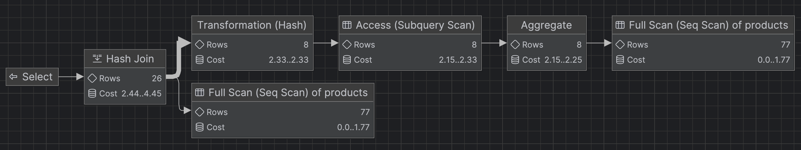

```sql
3. 27 rows retrieved starting from 1 in 340 ms (execution: 7 ms, fetching: 333 ms)
Plan:
```
3. 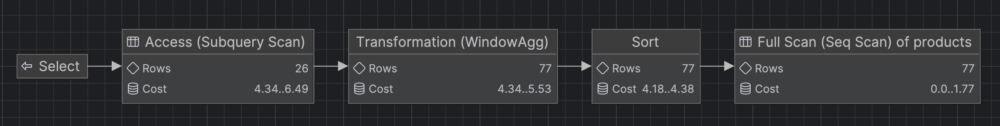
```sql
SQLite
1. 27 rows retrieved starting from 1 in 360 ms (execution: 5 ms, fetching: 355 ms)
Plan:
```
1. 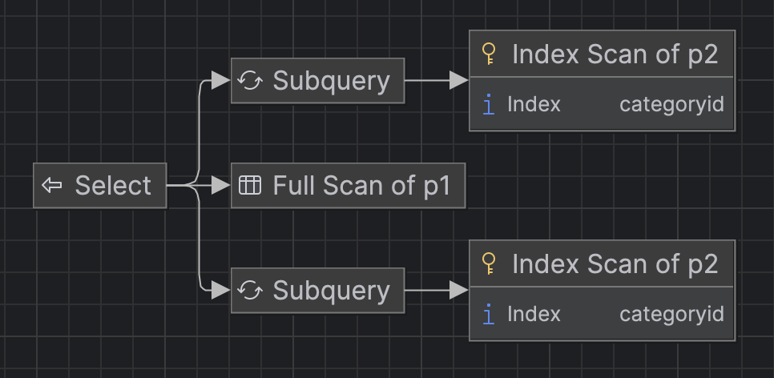
```sql
2. 27 rows retrieved starting from 1 in 356 ms (execution: 4 ms, fetching: 352 ms)
```
2. 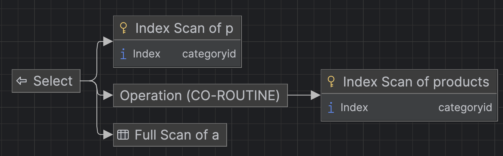
```sql
3. 27 rows retrieved starting from 1 in 323 ms (execution: 4 ms, fetching: 319 ms)
```
3. 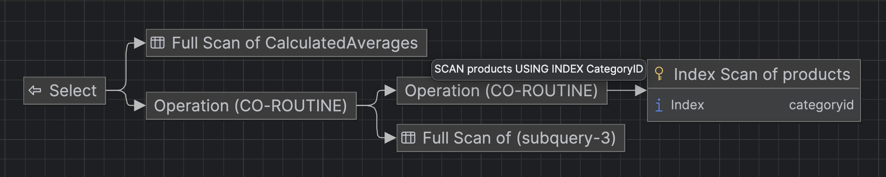

```sql

Analizując wyniki zapytań z Zadania 4, w którym konieczne było obliczenie średniej ceny produktów w danej kategorii i odfiltrowanie tych droższych niż średnia, można zauważyć wyraźniejsze różnice w wydajności w zależności od wybranej metody, co jest szczególnie widoczne w środowisku MS SQL Server. W tym silniku użycie skorelowanego podzapytania okazało się najmniej optymalne, generując czas egzekucji na poziomie 27 ms, co wynika z faktu, że baza musi przeliczać warunki wielokrotnie dla każdego wiersza. Zastosowanie złączenia (JOIN) oraz funkcji okna z partycjonowaniem znacząco poprawiło ten wynik, redukując czas wykonania do odpowiednio 15 ms i 17 ms. Z kolei systemy PostgreSQL oraz SQLite wykazały się bardzo agresywną optymalizacją, obsługując wszystkie trzy warianty zapytań w niemal identycznym, niezwykle krótkim czasie (od 4 do 7 ms), co sugeruje, że ich optymalizatory pod spodem przekształciły skorelowane podzapytanie do postaci wydajniejszego złączenia. Podsumowując, chociaż nowoczesne i lekkie silniki potrafią sprawnie zoptymalizować każdy kod, korzystanie z funkcji okna (lub złączeń) zamiast skorelowanych podzapytań jest praktyką znacznie bezpieczniejszą, która zapobiega spadkom wydajności w bardziej rygorystycznych środowiskach korporacyjnych takich jak MS SQL, zachowując przy tym wysoką czytelność logiki analitycznej.
```
---


# Zadanie 5

Oryginalna baza Northwind jest bardzo mała. Warto zaobserwować działanie na nieco większym zbiorze danych.

Baza Northwind3 zawiera dodatkową tabelę product_history

- 2,2 mln wierszy

Bazę Northwind3 można pobrać z moodle (zakładka - Backupy baz danych)

Wykonaj polecenia: `select count(*) from product_history`, potwierdzające wykonanie zadania

---

> Wyniki:


# Zadanie 6

Baza: Northwind, tabela product_history

Napisz polecenie, które zwraca: id pozycji, id produktu, nazwę produktu, id_kategorii, cenę produktu, średnią cenę produktów w kategorii do której należy dany produkt. Wyświetl tylko pozycje (produkty) których cena jest większa niż średnia cena.

W przypadku długiego czasu wykonania ogranicz zbiór wynikowy do kilkuset/kilku tysięcy wierszy

pomocna może być konstrukcja `with`

```sql
with t as (

....
)
select * from t
where id between ....
```

Napisz polecenie z wykorzystaniem podzapytania, join'a oraz funkcji okna. Porównaj zapytania. Porównaj czasy oraz plany wykonania zapytań.

Przetestuj działanie w różnych SZBD (MS SQL Server, PostgreSql, SQLite)

---

> Wyniki:
```sql
1)
WITH t AS (
    SELECT
        id,
        productid,
        productname,
        categoryid,
        unitprice,
        (SELECT AVG(unitprice) FROM product_history p2 WHERE p1.categoryid = p2.categoryid) AS avgprice
    FROM product_history p1
)
SELECT * FROM t
WHERE id BETWEEN 1 AND 10000
  AND unitprice > avgprice;

2)
WITH t AS (
    SELECT
        p.id,
        p.productid,
        p.productname,
        p.categoryid,
        p.unitprice,
        a.avgprice
    FROM product_history p
    JOIN (
        SELECT categoryid, AVG(unitprice) AS avgprice
        FROM product_history
        GROUP BY categoryid
    ) a ON p.categoryid = a.categoryid
)
SELECT * FROM t
WHERE id BETWEEN 1 AND 10000
  AND unitprice > avgprice;

3)
WITH t AS (
    SELECT
        id,
        productid,
        productname,
        categoryid,
        unitprice,
        AVG(unitprice) OVER(PARTITION BY categoryid) AS avgprice
    FROM product_history
)
SELECT * FROM t
WHERE id BETWEEN 1 AND 10000
  AND unitprice > avgprice;
```

```sql
SQL
1. 500 rows retrieved starting from 1 in 394 ms (execution: 56 ms, fetching: 338 ms)
Plan:
```
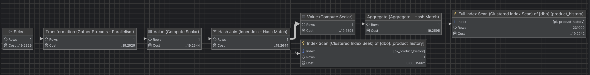

```sql
2. 500 rows retrieved starting from 1 in 431 ms (execution: 86 ms, fetching: 345 ms)
Plan:
```
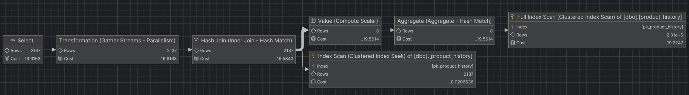
```sql
3. 500 rows retrieved starting from 1 in 606 ms (execution: 268 ms, fetching: 338 ms)
Plan:
```
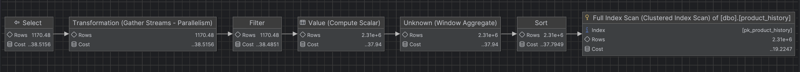
```sql
Postgres
1. 500 rows retrieved starting from 1 in 2 m 35 s 214 ms (execution: 2 m 34 s 847 ms, fetching: 367 ms)
Plan:
```
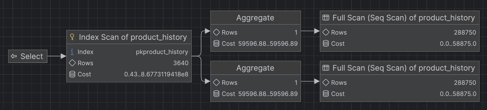
```sql
2. 500 rows retrieved starting from 1 in 615 ms (execution: 272 ms, fetching: 343 ms)
Plan:
```
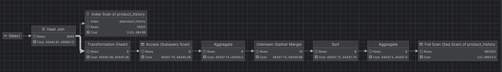
```sql
3. 500 rows retrieved starting from 1 in 1 s 165 ms (execution: 820 ms, fetching: 345 ms)
Plan:
```
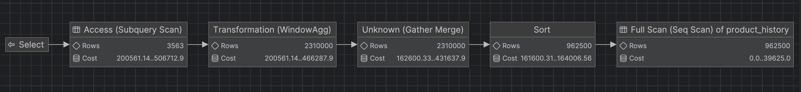
```sql
SQLite
1. 500 rows retrieved starting from 1 in 2 m 18 s 367 ms (execution: 996 ms, fetching: 2 m 17 s 371 ms)
Plan:
```
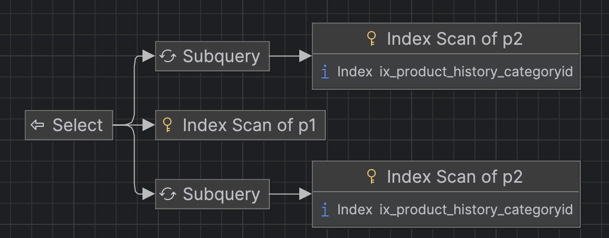
```sql
2. 500 rows retrieved starting from 1 in 441 ms (execution: 102 ms, fetching: 339 ms)
Plan:
```
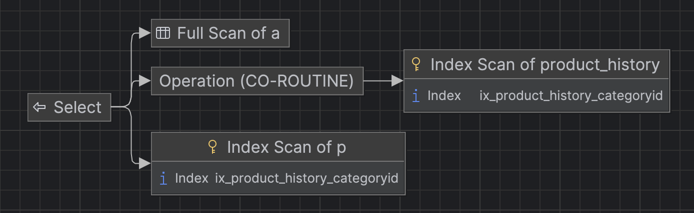
```sql
3. 500 rows retrieved starting from 1 in 569 ms (execution: 234 ms, fetching: 335 ms)
Plan:
```
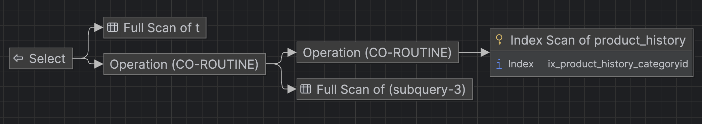

```sql
Analiza wyników na ponad dwumilionowym zbiorze danych obnaża ogromne różnice w optymalizacji silników. Zastosowanie skorelowanego podzapytania doprowadziło do całkowitego załamania wydajności w PostgreSQL i SQLite (czasy egzekucji powyżej 2 minut), podczas gdy zaawansowany optymalizator MS SQL Server poradził sobie z nim w zaledwie 56 ms. Najbardziej stabilnym rozwiązaniem na wszystkich platformach okazało się złączenie (JOIN), osiągając bardzo dobre i wyrównane czasy rzędu kilkuset milisekund. Funkcja okna wypadła w tym specyficznym przypadku nieco gorzej od JOIN-a (czasy od 234 ms do 820 ms), ponieważ wymusiła na silnikach wykonanie kosztownego partycjonowania całego, dwumilionowego zbioru przed ostatecznym odfiltrowaniem wyników na zewnątrz (WHERE id BETWEEN). Podsumowując: przy dużych wolumenach danych należy bezwzględnie unikać skorelowanych podzapytań na rzecz złączeń (JOIN), które gwarantują wysoką i przewidywalną wydajność niezależnie od używanego systemu bazodanowego.
```

---

|         |     |
| ------- | --- |
| zadanie | pkt |
| 1       | 1   |
| 2       | 1   |
| 3       | 1   |
| 4       | 1   |
| 5       | 1   |
| 6       | 2   |
| razem:  | 7   |
