## SQL - Funkcje okna (Window functions) <br> Lab 2

---

**Imiona i nazwiska: Jan Małek**

--- 


Celem ćwiczenia jest zapoznanie się z działaniem funkcji okna (window functions) w SQL, analiza wydajności zapytań i porównanie z rozwiązaniami przy wykorzystaniu "tradycyjnych" konstrukcji SQL

Swoje odpowiedzi wpisuj w miejsca oznaczone jako:

---
> Wyniki: 

```sql
--  ...
```

---

### Ważne/wymagane są komentarze.

Zamieść kod rozwiązania oraz zrzuty ekranu pokazujące wyniki, (dołącz kod rozwiązania w formie tekstowej/źródłowej)

Zwróć uwagę na formatowanie kodu

---

## Oprogramowanie - co jest potrzebne?

Do wykonania ćwiczenia potrzebne jest następujące oprogramowanie:
- MS SQL Server - wersja 2019, 2022
- PostgreSQL - wersja 15/16/17
- SQLite
- Narzędzia do komunikacji z bazą danych
	- SSMS - Microsoft SQL Managment Studio
	- DtataGrip lub DBeaver
-  Przykładowa baza Northwind/Northwind3
	- W wersji dla każdego z wymienionych serwerów

Oprogramowanie dostępne jest na przygotowanej maszynie wirtualnej

## Dokumentacja/Literatura

- Kathi Kellenberger,  Clayton Groom, Ed Pollack, Expert T-SQL Window Functions in SQL Server 2019, Apres 2019
- Itzik Ben-Gan, T-SQL Window Functions: For Data Analysis and Beyond, Microsoft 2020

- Kilka linków do materiałów które mogą być pomocne
	 - [https://learn.microsoft.com/en-us/sql/t-sql/queries/select-over-clause-transact-sql?view=sql-server-ver16](https://learn.microsoft.com/en-us/sql/t-sql/queries/select-over-clause-transact-sql?view=sql-server-ver16)
	- [https://www.sqlservertutorial.net/sql-server-window-functions/](https://www.sqlservertutorial.net/sql-server-window-functions/)
	- [https://www.sqlshack.com/use-window-functions-sql-server/](https://www.sqlshack.com/use-window-functions-sql-server/)
	- [https://www.postgresql.org/docs/current/tutorial-window.html](https://www.postgresql.org/docs/current/tutorial-window.html)
	- [https://www.postgresqltutorial.com/postgresql-window-function/](https://www.postgresqltutorial.com/postgresql-window-function/)
	- [https://www.sqlite.org/windowfunctions.html](https://www.sqlite.org/windowfunctions.html)
	- [https://www.sqlitetutorial.net/sqlite-window-functions/](https://www.sqlitetutorial.net/sqlite-window-functions/)


- W razie potrzeby - opis Ikonek używanych w graficznej prezentacji planu zapytania w SSMS jest tutaj:
	- [https://docs.microsoft.com/en-us/sql/relational-databases/showplan-logical-and-physical-operators-reference](https://docs.microsoft.com/en-us/sql/relational-databases/showplan-logical-and-physical-operators-reference)

## Przygotowanie

Uruchom SSMS
- Skonfiguruj połączenie  z bazą Northwind na lokalnym serwerze MS SQL 

Uruchom DataGrip (lub Dbeaver)
- Skonfiguruj połączenia z bazą Northwind3
	- na lokalnym serwerze MS SQL
	- na lokalnym serwerze PostgreSQL
	- z lokalną bazą SQLite

Można też skorzystać z innych narzędzi klienckich (wg własnego uznania)

Oryginalna baza Northwind jest bardzo mała. Warto zaobserwować działanie na nieco większym zbiorze danych.

Korzystamy ze "zmodyfikowanej wersji" bazy northwind

Baza Northwind3 zawiera dodatkową tabelę product_history
- 2,2 mln wierszy

Bazę Northwind3 można pobrać z moodle (zakładka - Backupy baz danych)


# Zadanie 1 

Funkcje rankingu, `row_number()`, `rank()`, `dense_rank()`


```sql 
select productid, productname, unitprice, categoryid,  
    row_number() over(partition by categoryid order by unitprice desc) as rowno,  
    rank() over(partition by categoryid order by unitprice desc) as rankprice,  
    dense_rank() over(partition by categoryid order by unitprice desc) as denserankprice  
from products;
```

Wykonaj polecenie, zaobserwuj wynik. Porównaj funkcje row_number(), rank(), dense_rank().  Skomentuj wyniki. 

Spróbuj uzyskać ten sam wynik bez użycia funkcji okna

Do analizy użyj wybranego systemu/bazy danych - wybierz MS SQLserver, Postgres lub SQLite)

---
> Wyniki: 

```text
ROW_NUMBER(): Zawsze nadaje unikalny numer, nawet dla tych samych wartości.

RANK(): Pozostawia luki w numeracji po remisach (np. 1, 2, 2, 4).

DENSE_RANK(): Nie pozostawia luk (np. 1, 2, 2, 3).
```

```sql
SELECT p1.ProductID, p1.ProductName, p1.UnitPrice, p1.CategoryID,

    (select count(*) + 1
        from products p2
        where p2.categoryid = p1.categoryid
        and (p2.unitprice > p1.unitprice or (p2.unitprice = p1.unitprice and
        p2.productid < p1.productid))
    ) as rowno,

    (select COUNT(*) + 1 from Products p2
     where p2.CategoryID = p1.CategoryID
       and p2.UnitPrice > p1.UnitPrice
     ) as RankPrice,

     (select count(distinct p2.unitprice) + 1
        from products p2
        where p2.categoryid = p1.categoryid
        and p2.unitprice > p1.unitprice
      ) as DenseRankPrice

FROM Products p1
ORDER BY CategoryID, UnitPrice DESC;
```
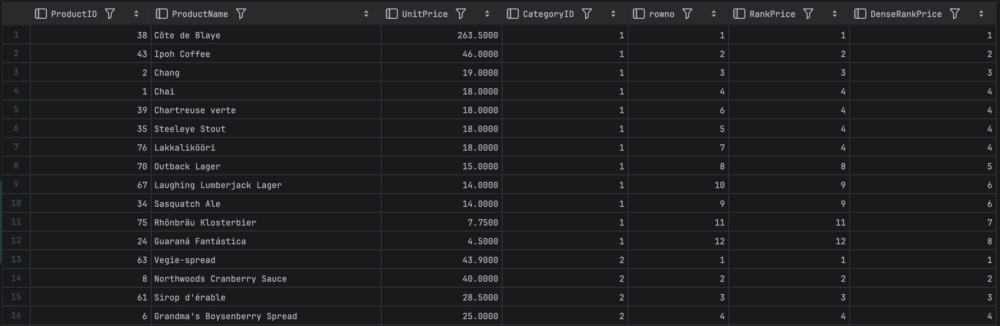

---
# Zadanie 2

Baza: Northwind, tabela product_history

Dla każdego produktu, podaj 4 najwyższe ceny tego produktu w danym roku. Zbiór wynikowy powinien zawierać:
- rok
- id produktu
- nazwę produktu
- cenę
- datę (datę uzyskania przez produkt takiej ceny)
- pozycję w rankingu

- Uporządkuj wynik wg roku, nr produktu, pozycji w rankingu

W przypadku długiego czasu wykonania ogranicz zbiór wynikowy.

Spróbuj uzyskać ten sam wynik bez użycia funkcji okna, porównaj wyniki, czasy i plany zapytań (koszty). 

Przetestuj działanie w różnych SZBD (MS SQL Server, PostgreSql, SQLite)


---
> Wyniki: 

MSSQL
```sql
Z oknem

WITH RankedPrices AS (
    SELECT
    YEAR(date) as Year, productid, productname, unitprice, date,
    dense_rank() over (partition by productid, YEAR(date) order by unitprice desc) as Position
    FROM product_history
)
SELECT * from RankedPrices
WHERE Position <= 4
ORDER BY Year, productid, Position;
```

```sql
Bez okna

SELECT
    YEAR(ph1.date) AS Year,
    ph1.productid,
    ph1.productname,
    ph1.unitprice,
    ph1.date
FROM product_history ph1
WHERE (
    SELECT COUNT(DISTINCT ph2.unitprice)
    FROM product_history ph2
    WHERE ph2.productid=ph1.productid
    AND YEAR(ph2.date) = YEAR(ph1.date)
    AND ph2.unitprice = ph1.unitprice
) < 4
ORDER BY Year, ph1.productid, ph1.unitprice DESC;

```


* Z oknem

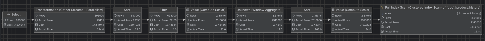
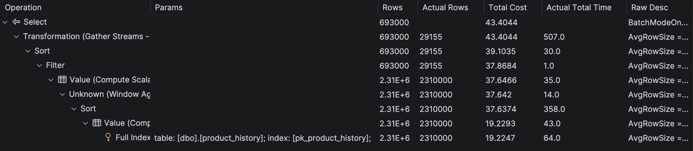

```text
500 rows retrieved starting from 1 in 779 ms (execution: 418 ms, fetching: 361 ms)
Koszt 43.4
Actual time: 507
```


* Bez okna
  
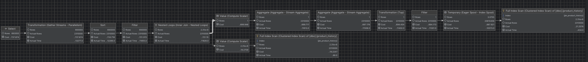
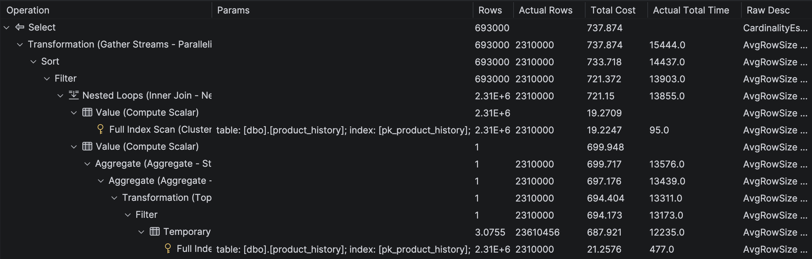

```text
500 rows retrieved starting from 1 in 13 s 727 ms (execution: 13 s 406 ms, fetching: 321 ms)
Koszt 737.87
Actual time: 15444.0
```

>Analiza planów wykonania w MSSQL potwierdza przewagę funkcji okienkowych, mimo że optymalizator tego silnika jest znacznie skuteczniejszy w niż Postgres czy SQLite. Zastosowanie `DENSE_RANK()` pozwala na wykonanie operacji w czasie **~0.5 s** przy koszcie **43.4**. Alternatywne podejście oparte na podzapytaniu skorelowanym, generuje wyższy koszt operacyjny (**737.87**) i wydłuża czas wykonania do ponad **15 sekund**. Wyniki te jednoznacznie wskazują, że funkcje okna są optymalnym standardem przetwarzania danych.


Postgres ograniczony do 4 produktów i 2 lat

```sql
Z oknem

WITH RankedPrices AS (
    SELECT
        EXTRACT(YEAR FROM ph.date) as Year, ph.productid, ph.productname, ph.unitprice, ph.date,
        DENSE_RANK() OVER (PARTITION BY ph.productid, EXTRACT(YEAR FROM ph.date) ORDER BY ph.unitprice DESC) as Position
    FROM product_history ph
    JOIN products p on ph.productid = p.productid

    WHERE extract(YEAR FROM ph.date) in (2018,2019,2020,2021,2022)
    and ph.productid between 1 and 4
)
SELECT * FROM RankedPrices
WHERE Position <= 4
ORDER BY Year, productid, Position;
```

```sql
Bez okna

SELECT
    EXTRACT(YEAR FROM ph1.date) AS Year,
    ph1.productid,
    ph1.productname,
    ph1.unitprice,
    ph1.date
FROM product_history ph1
WHERE (
    SELECT COUNT(DISTINCT ph2.unitprice)
    FROM product_history ph2
    WHERE ph2.productid = ph1.productid
    AND EXTRACT(YEAR FROM ph2.date) = EXTRACT(YEAR FROM ph1.date)
    AND ph2.unitprice > ph1.unitprice
) < 4
ORDER BY Year, ph1.productid, ph1.unitprice DESC;

```

* Z oknem
 
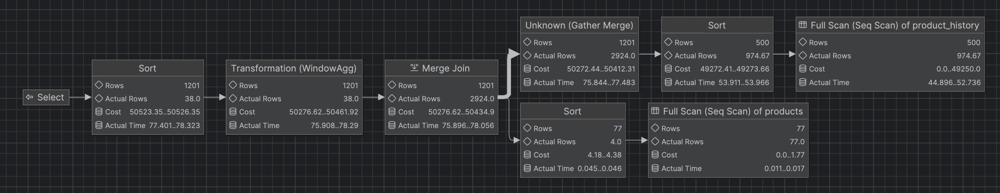
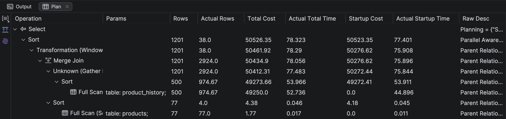

>38 rows retrieved starting from 1 in 502 ms (execution: 158 ms, fetching: 344 ms)
>
>Koszt 50526.35
>
>Actual time: 78.323

* Bez okna

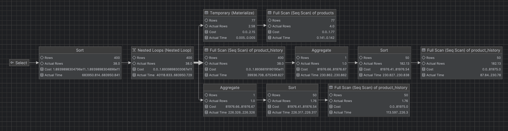
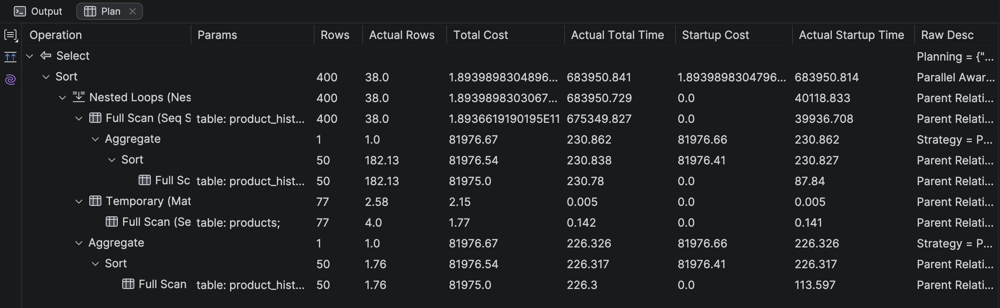

>38 rows retrieved starting from 1 in 12 m 56 s 444 ms (execution: 12 m 56 s 73 ms, fetching: 371 ms)
>
>Koszt 1.89E11
>
>Actual time: 683950.841
>


>
>Analiza planów wykonania w PostgreSQL pokazuje przewage funkcji okienkowych (`DENSE_RANK`) nad podzapytaniami skorelowanymi: podczas gdy funkcja okna przetwarza dane w czasie ~78 ms (koszt 50 tys.), zapytanie bez okien zmusza bazę do wykonania wielokrotnych, skanowań tabeli, co przy duzej ilosci wierszy skutkuje wzorstem kosztow do poziomu 189 miliardów i czasem wykonania przekraczającym 11 minut. Funkcje okna są zatem nie tylko czytelniejsze, ale stanowią niezbędną optymalizację, bez której praca na dużych zbiorach danych jest nieefektywna i obciążająca dla zasobów serwera.
>

<br>
<br>
<br>
<br>
<br>


SQLite

```sql

WITH RankedPrices AS (
    SELECT
        strftime('%Y', date) as Year, productid, productname, unitprice, date,
        DENSE_RANK() OVER (PARTITION BY productid, strftime('%Y', date) ORDER BY unitprice DESC) as Position
    FROM product_history
)
SELECT * FROM RankedPrices
WHERE Position <= 4
ORDER BY Year, productid, Position;
```

```sql
SELECT
    strftime('%Y', ph1.date) AS Year,
    ph1.productid,
    ph1.productname,
    ph1.unitprice,
    ph1.date
FROM product_history ph1
WHERE (
    SELECT COUNT(DISTINCT ph2.unitprice)
    FROM product_history ph2
    WHERE ph2.productid = ph1.productid
    AND strftime('%Y', ph2.date) = strftime('%Y', ph1.date)
    AND ph2.unitprice > ph1.unitprice
) < 4
ORDER BY Year, ph1.productid, ph1.unitprice DESC;
```

* Z oknem
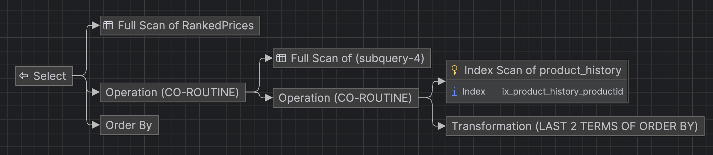
>88 rows retrieved starting from 1 in 396 ms (execution: 53 ms, fetching: 343 ms)

* Bez okna

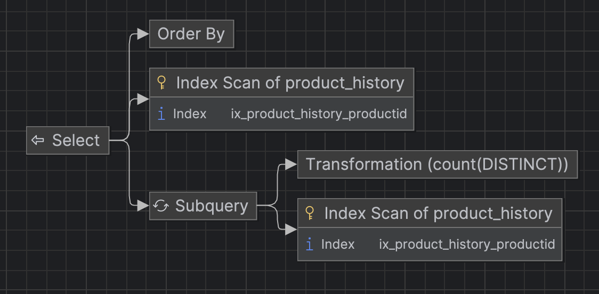
>88 rows retrieved starting from 1 in 4 m 57 s 642 ms (execution: 4 m 57 s 303 ms, fetching: 339 ms)


>Analiza planów wykonania w SQLite wyraźnie pokazuje, że użycie funkcji okienkowych (`DENSE_RANK`) redukuje czas wykonania zapytania z **prawie 5 minut** do **niespełna 400 ms**.


>Wnioski: Testy na MSSQL, PostgreSQL i SQLite jednoznacznie dowodzą, że funkcje okienkowe (`DENSE_RANK`) są bardzo wydajne. Podczas gdy zapytania z funkcjami okna przetwarzają dane w ułamku sekundy, podejście z podzapytaniami skorelowanymi zmusza bazę do wielokrotnego skanowania tabeli, co w zależności od systemu wydłuża czas wykonania od kilkudziesięciu razy (MSSQL) do nawet kilkunastu tysięcy razy (PostgreSQL).


# Zadanie 3 

Funkcje `lag()`, `lead()`

Wykonaj polecenia, zaobserwuj wynik. Jak działają funkcje `lag()`, `lead()`

```sql
select productid, productname, categoryid, date, unitprice,  
       lag(unitprice) over (partition by productid order by date)   
as previousprodprice,  
       lead(unitprice) over (partition by productid order by date)   
as nextprodprice  
from product_history  
where productid = 1 and year(date) = 2022  
order by date;  
  
with t as (select productid, productname, categoryid, date, unitprice,  
                  lag(unitprice) over (partition by productid   
order by date) as previousprodprice,  
                  lead(unitprice) over (partition by productid   
order by date) as nextprodprice  
           from product_history  
           )  
select * from t  
where productid = 1 and year(date) = 2022  
order by date;
```

Jak działają funkcje `lag()`, `lead()`?

Spróbuj uzyskać ten sam wynik bez użycia funkcji okna

Do analizy użyj wybranego systemu/bazy danych - wybierz MS SQLserver, Postgres lub SQLite

---
> Wyniki: 

```
LAG(): Pobiera wartość z poprzedniego wiersza. W zadaniu pozwala sprawdzić, jaka była cena produktu w poprzednim dniu notowania.

LEAD(): Pobiera wartość z następnego wiersza. Pozwala sprawdzić, jaka będzie cena produktu w kolejnym dniu.

W pierwszym wierszu kolumna previousprodprice będzie miała wartość NULL, bo nie ma wcześniejszego rekordu.

W ostatnim wierszu kolumna nextprodprice będzie miała wartość NULL, bo nie ma kolejnego rekordu.

```

```sql
select ph1.productid, ph1.productname, ph1.categoryid, ph1.date, ph1.unitprice,
    
    (SELECT TOP 1 ph2.unitprice
        FROM product_history ph2
        WHERE ph2.productid = ph1.productid AND ph2.date<ph1.date
        ORDER BY ph2.date DESC ) AS previousprodprice,
    
    (SELECT TOP 1 ph3.unitprice
     FROM product_history ph3
     WHERE ph3.productid = ph1.productid AND ph3.date>ph1.date
     ORDER BY ph3.date ASC ) AS nextprodprice

FROM product_history ph1
WHERE ph1.productid = 1 AND YEAR(ph1.date) = 2022
ORDER BY ph1.date;
```

---


# Zadanie 4

Baza: Northwind, tabele customers, orders, order details

Napisz polecenie które wyświetla inf. o zamówieniach

Zbiór wynikowy powinien zawierać:
- nazwę klienta, nr zamówienia,
- datę zamówienia,
- wartość zamówienia (wraz z opłatą za przesyłkę),
- nr poprzedniego zamówienia danego klienta,
- datę poprzedniego zamówienia danego klienta,
- wartość poprzedniego zamówienia danego klienta.

Do analizy użyj wybranego systemu/bazy danych - wybierz MS SQLserver, Postgres lub SQLite

---
> Wyniki: 


```sql
WITH OrderValues AS(
    select o.customerid, o.orderid, o.orderdate, o.freight,
    sum(od.unitprice * od.quantity * (1-od.discount)) + o.freight as TotalValue
    from Orders o
    join [orderdetails] od on o.orderid = od.orderid
    group by o.customerid, o.orderid, o.orderdate, o.freight
)

select
    customerid, orderid, orderdate, TotalValue,

    LAG(orderid) over(partition by customerid order by orderdate) as prevOrderid,

    LAG(orderdate) over(partition by customerid order by orderdate) as prevOrderDate,

    LAG(TotalValue) over(partition by customerid order by orderdate) as prevOrderValue

from OrderValues
```
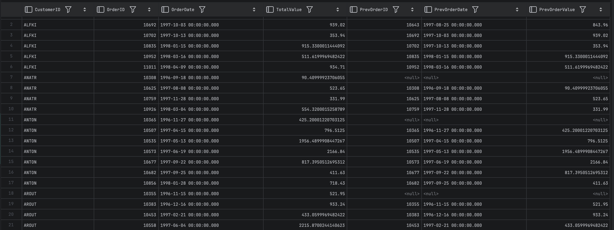


---


# Zadanie 5 

Funkcje `first_value()`, `last_value()`

Baza: Northwind, tabele customers, orders, order details

Wykonaj polecenia, zaobserwuj wynik. Jak działają funkcje `first_value()`, `last_value()`. 

Skomentuj uzyskane wyniki. Czy funkcja `first_value` pokazuje w tym przypadku najdroższy produkt w danej kategorii, czy funkcja `last_value()` pokazuje najtańszy produkt? 

Co jest przyczyną takiego działania funkcji `last_value`. 

Co trzeba zmienić żeby funkcja last_value pokazywała najtańszy produkt w danej kategorii?

Do analizy użyj wybranego systemu/bazy danych - wybierz MS SQLserver, Postgres lub SQLite

```sql
select productid, productname, unitprice, categoryid,

    first_value(productname) over (partition by categoryid   
order by unitprice desc) first,  

    last_value(productname) over (partition by categoryid   
order by unitprice desc) last  

from products  
order by categoryid, unitprice desc;
```


---
> Wyniki: 

```text
Kolumna first (najdroższy): Poprawnie wyświetla nazwę najdroższego produktu dla całej kategorii w każdym wierszu.

Kolumna last (najtańszy): Działa błędnie. Zamiast najtańszego produktu w kategorii, wyświetla nazwę produktu z bieżącego wiersza. Po przejściu do kolejnego wiersza, wartość w kolumnie last się zmieni.

```

Skomentuj uzyskane wyniki. Czy funkcja `first_value` pokazuje w tym przypadku najdroższy produkt w danej kategorii, czy funkcja `last_value()` pokazuje najtańszy produkt? 


>Tak, na pierwszym zrzucie ekranu (kolumna first), dla kategorii 1 funkcja zwraca wartość „Côte de Blaye”, czyli produkt z najwyższą ceną w tej partycji.

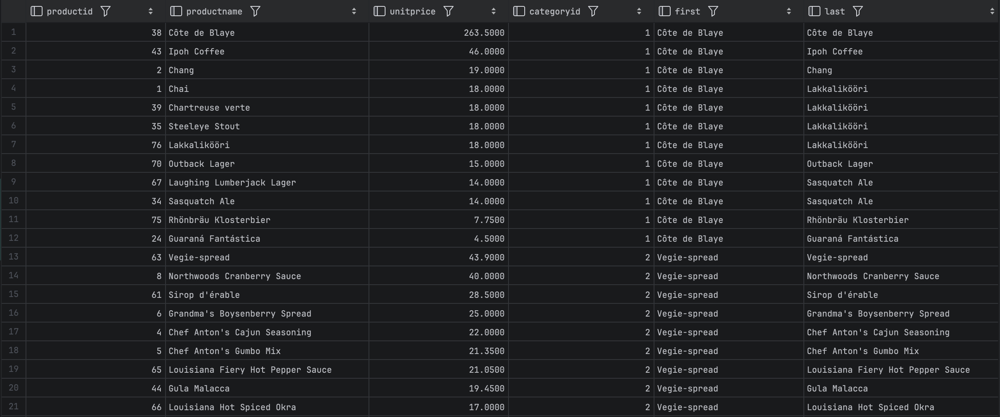

>Nie, funkcja `last_value()` kopiuje nazwę produktu z bieżącego wiersza zamiast pokazać najtańszy produkt.

Co jest przyczyną takiego działania funkcji `last_value`. 

>Domyślnie last_value czyta wiersze tylko od początku grupy do aktualnego wiersza. Nie sprawdza dalszych danych, więc traktuje obecny wiersz jako ostatni i zwraca jego wartość.

Co trzeba zmienić żeby funkcja last_value pokazywała najtańszy produkt w danej kategorii?

>Trzeba jawnie zdefiniować ramkę okna tak, aby obejmowała całą kategorie, a nie kończyła się na bieżącym wierszu.


```sql
select productid, productname, unitprice, categoryid,
    first_value(productname) over (partition by categoryid
order by unitprice desc) first,
    last_value(productname) over (partition by categoryid
order by unitprice desc
        RANGE BETWEEN UNBOUNDED PRECEDING AND UNBOUNDED FOLLOWING)
    last
from products
order by categoryid, unitprice desc;
```


---


# Zadanie 6

Baza: Northwind, tabele orders, order details

Napisz polecenie które wyświetla inf. o zamówieniach

Zbiór wynikowy powinien zawierać:
- Id klienta,
- nr zamówienia,
- datę zamówienia,
- wartość zamówienia (wraz z opłatą za przesyłkę),
- dane zamówienia klienta o najniższej wartości w danym miesiącu
	- nr zamówienia o najniższej wartości w danym miesiącu
	- datę tego zamówienia
	- wartość tego zamówienia
- dane zamówienia klienta o najwyższej wartości w danym miesiącu
	- nr zamówienia o najniższej wartości w danym miesiącu
	- datę tego zamówienia
	- wartość tego zamówienia

Do analizy użyj wybranego systemu/bazy danych - wybierz MS SQLserver, Postgres lub SQLite

---
<br>
<br>
<br>
<br>
<br>
<br>
<br>
<br>
<br>
<br>


> Wyniki: 

```sql
WITH OrderValues AS (
    SELECT
        o.CustomerID,
        o.OrderID,
        o.OrderDate,
        SUM(od.UnitPrice * od.Quantity * (1 - od.Discount)) + o.Freight AS OrderTotal,
        FORMAT(o.OrderDate, 'yyyy-MM') AS YearMonth
    FROM Orders o
    JOIN [OrderDetails] od ON o.OrderID = od.OrderID
    GROUP BY o.CustomerID, o.OrderID, o.OrderDate, o.Freight
)
SELECT
    CustomerID,
    OrderID,
    OrderDate,
    OrderTotal,

    FIRST_VALUE(OrderID) OVER (PARTITION BY YearMonth ORDER BY OrderTotal ASC) AS MinOrderID,
    FIRST_VALUE(OrderDate) OVER (PARTITION BY YearMonth ORDER BY OrderTotal ASC) AS MinOrderDate,
    FIRST_VALUE(OrderTotal) OVER (PARTITION BY YearMonth ORDER BY OrderTotal ASC) AS MinOrderValue,

    FIRST_VALUE(OrderID) OVER (PARTITION BY YearMonth ORDER BY OrderTotal DESC) AS MaxOrderID,
    FIRST_VALUE(OrderDate) OVER (PARTITION BY YearMonth ORDER BY OrderTotal DESC) AS MaxOrderDate,
    FIRST_VALUE(OrderTotal) OVER (PARTITION BY YearMonth ORDER BY OrderTotal DESC) AS MaxOrderValue

FROM OrderValues
ORDER BY CustomerID,YearMonth, OrderTotal;

```

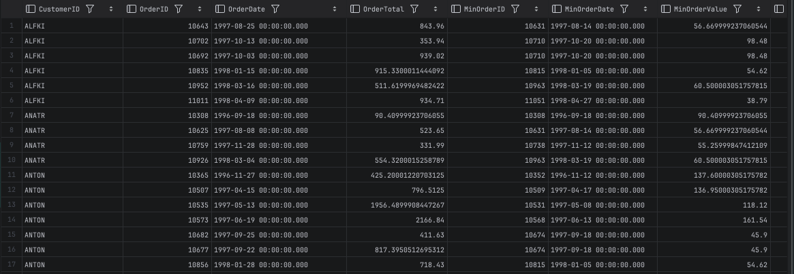
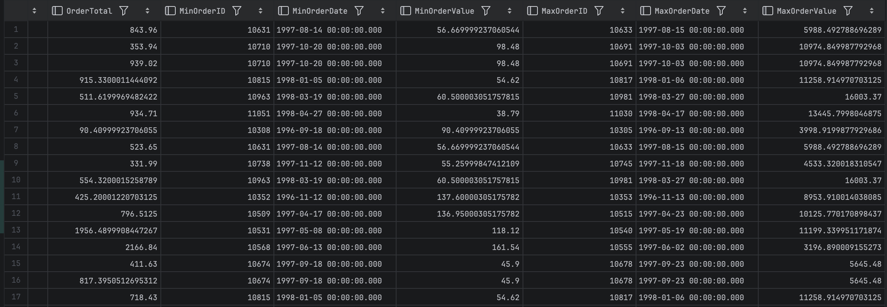

---


# Zadanie 7

Baza: Northwind, tabela product_history

Napisz polecenie które pokaże wartość sprzedaży każdego produktu narastająco od początku każdego miesiąca. Użyj funkcji okna

Zbiór wynikowy powinien zawierać:
- id pozycji
- id produktu
- datę
- wartość sprzedaży produktu w danym dniu
- wartość sprzedaży produktu narastające od początku miesiąca

Spróbuj uzyskać ten sam wynik bez użycia funkcji okna, porównaj wyniki, czasy i plany zapytań (koszty). 

Przetestuj działanie w różnych SZBD (MS SQL Server, PostgreSql, SQLite)

---
> Wyniki: 

MSSQL
```sql
SELECT
    productid,
    date,
    unitprice AS daily_value,
    SUM(unitprice) OVER (
        PARTITION BY productid, YEAR(date), MONTH(date)
        ORDER BY date, id
        ROWS BETWEEN UNBOUNDED PRECEDING AND CURRENT ROW
    ) AS running_total_from_month_start
FROM product_history
ORDER BY productid, date;
```

```sql
Bez funkcji okna 
SELECT
    ph1.id,
    ph1.productid,
    ph1.date,
    ph1.unitprice,
    (SELECT SUM(ph2.unitprice)
     FROM product_history ph2
     WHERE ph2.productid = ph1.productid
       AND YEAR(ph2.date) = YEAR(ph1.date)
       AND MONTH(ph2.date) = MONTH(ph1.date)
       AND (ph2.date < ph1.date OR (ph2.date = ph1.date AND ph2.id <= ph1.id))
    ) AS running_total_month
FROM product_history ph1
ORDER BY ph1.productid, ph1.date;
```

* Z oknem

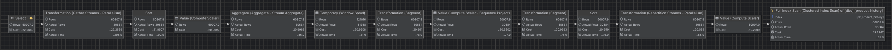
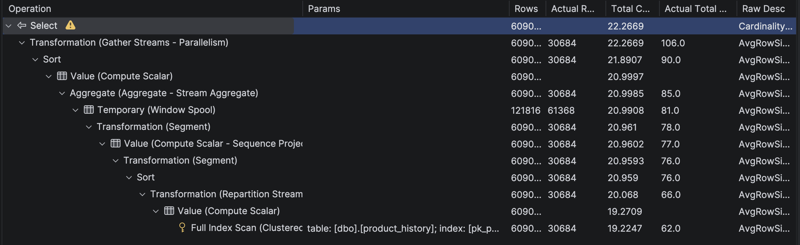

>500 rows retrieved starting from 1 in 473 ms (execution: 118 ms, fetching: 355 ms)
>
>Koszt 22.2669
>
>Actual time: 106

* Bez okna 

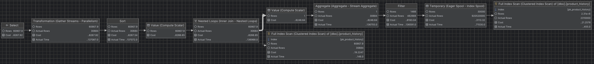
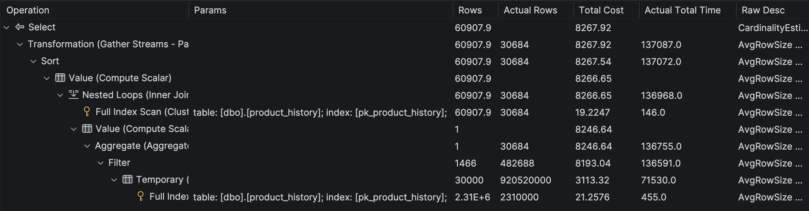

>500 rows retrieved starting from 1 in 1 m 56 s 513 ms (execution: 1 m 56 s 157 ms, fetching: 356 ms)
>
>Koszt 8267.92
>
>Actual time: 137087


>Analiza planów wykonania potwierdza przewagę funkcji okienkowych. Wykorzystanie SUM(...) OVER(...) z pozwoliło na przetworzenie danych w czasie 106 ms (koszt 22.3). Alternatywne rozwiązanie oparte na podzapytaniu skorelowanym zmusza serwer do wykonania kosztownej pętli Nested Loops z agregacją dla każdego wiersza, co zwiększa koszt operacyjny do 8267.9 i wydłuża czas wykonania do ponad 116 sekund.

Postgres

```sql
Z oknem

SELECT
    productid,
    date,
    unitprice AS daily_value,
    SUM(unitprice) OVER (
        PARTITION BY productid, DATE_TRUNC('month', date)
        ORDER BY date, id
        ROWS BETWEEN UNBOUNDED PRECEDING AND CURRENT ROW
    ) AS running_total_from_month_start
FROM product_history
WHERE extract(year from date) = 2020
AND productid between 1 and 4
ORDER BY productid, date;
```

```sql
Bez okna

SELECT
    ph1.id, ph1.productid, ph1.date, ph1.unitprice,

    (SELECT SUM(ph2.unitprice)
     FROM product_history ph2
     WHERE ph2.productid = ph1.productid
       AND EXTRACT(YEAR FROM ph2.date) = EXTRACT(YEAR FROM ph1.date)
       AND EXTRACT(MONTH FROM ph2.date) = EXTRACT(MONTH FROM ph1.date)
       AND (ph2.date < ph1.date OR (ph2.date = ph1.date AND ph2.id <= ph1.id))
    ) AS running_total_month

FROM product_history ph1
WHERE extract(year from date) = 2020
AND productid between 1 and 4
ORDER BY productid, date;
```
* Z oknem

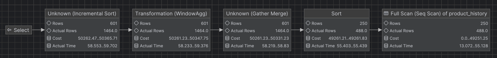
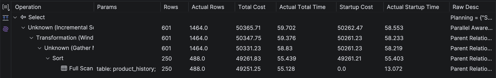

>500 rows retrieved starting from 1 in 1 s 716 ms (execution: 1 s 399 ms, fetching: 317 ms)
>
>Koszt 50365.71
>
>Actual time: 59.702

* Bez okna

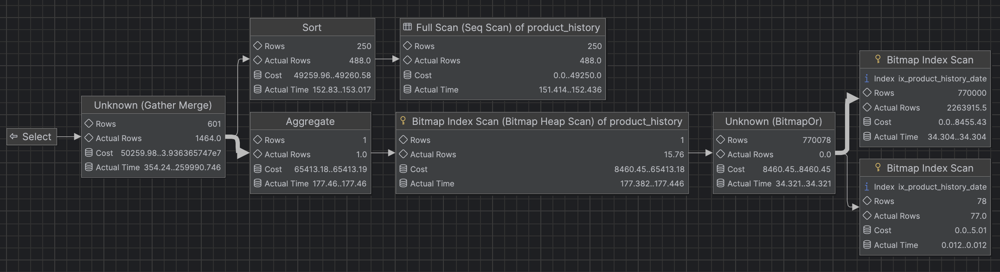
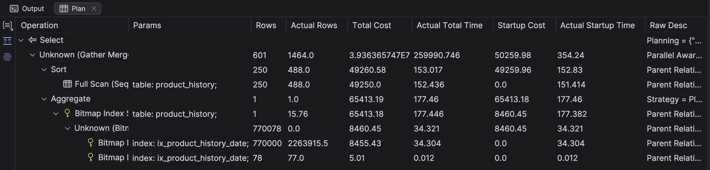
>500 rows retrieved starting from 1 in 1 m 34 s 9 ms (execution: 1 m 33 s 617 ms, fetching: 392 ms)
>
>Koszt 3.93E14
>
>Actual time: 259990.746

>Analiza planów wykonania w PostgreSQL potwierdza różnicę w wydajności obliczeń sum narastających. Zapytanie z funkcją okna (`SUM(...) OVER(...)`) przetwarza dane w **~60 ms** (koszt **50 tys.**). W przeciwieństwie do tego, zapytanie bez funkcji okiennych zmusza silnik bazy do ciągłego skanowania indeksów – koszt zapytania rośnie do **3.93E14**, a czas wykonania przekracza **94 sekundy**.

SQLite

```sql
SELECT
    productid,
    date,
    unitprice AS daily_value,
    SUM(unitprice) OVER (
        PARTITION BY productid, strftime('%Y-%m', date)
        ORDER BY date, id
        ROWS BETWEEN UNBOUNDED PRECEDING AND CURRENT ROW
    ) AS running_total_from_month_start
FROM product_history
WHERE strftime('%Y', date) BETWEEN '2000' AND '2020'
and productid between 1 and 4
ORDER BY productid, date;
```

<br>
<br>
<br>
<br>

```sql
SELECT
    ph1.id,
    ph1.productid,
    ph1.date,
    ph1.unitprice,
    (SELECT SUM(ph2.unitprice)
     FROM product_history ph2
     WHERE ph2.productid = ph1.productid
       AND STRFTIME('%Y-%m', ph2.date) = STRFTIME('%Y-%m', ph1.date)
       AND (ph2.date < ph1.date OR (ph2.date = ph1.date AND ph2.id <= ph1.id))
    ) AS running_total_month
FROM product_history ph1
WHERE strftime('%Y', date) BETWEEN '2000' AND '2020'
and productid between 1 and 4
ORDER BY ph1.productid, ph1.date;
```

* Z oknem

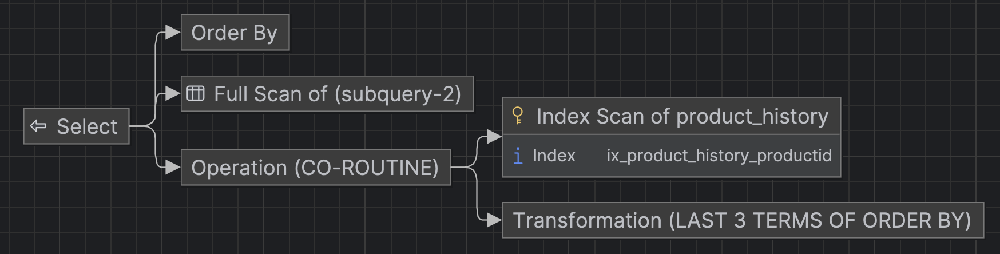

>500 rows retrieved starting from 1 in 539 ms (execution: 196 ms, fetching: 343 ms)

* Bez okna

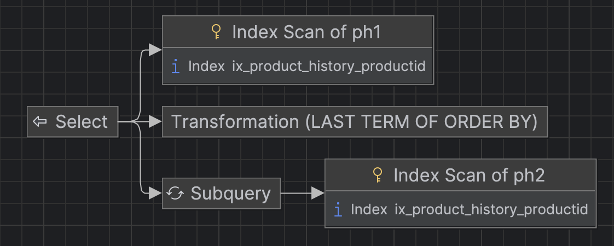
>500 rows retrieved starting from 1 in 5 m 28 s 347 ms (execution: 5 m 27 s 992 ms, fetching: 355 ms)

>Wykorzystanie `SUM(...) OVER(...)` pozwoliło na przetworzenie danych w **~196 ms**, gdzie operacja z podzapytaniem wydłuża czas wykonania do ponad **5 minut i 28 sekund**.

>Wnioski: Przeprowadzone testy we wszystkich trzech systemach (MSSQL, PostgreSQL, SQLite) jednoznacznie dowodzą, że funkcje okienkowe są standardem wydajności przy duzych zbiorach danych: podczas gdy zapytania z funkcjami okna przetwarzają dane w ułamku sekundy, podejście oparte na podzapytaniach skorelowanych – nawet przy celowym ograniczeniu zbioru danych dla PostgreSQL i SQLite – zmusza silnik bazy do iteracyjnego skanowania tabeli dla każdego wiersza, co prowadzi do drastycznej degradacji wydajności. Plany wykonania potwierdzają, że funkcje okienkowe eliminują kosztowne,operacje, stanowiąc efektywne rozwiązanie, bez którego praca na dużych zbiorach danych.

---


# Zadanie 8

Wykonaj kilka "własnych" przykładowych analiz. 

Czy są jeszcze jakieś ciekawe/przydatne funkcje okna (z których nie korzystałeś w ćwiczeniu)? Spróbuj ich użyć w zaprezentowanych przykładach.

Do analizy użyj wybranego systemu/bazy danych - wybierz MS SQLserver, Postgres lub SQLite)

---
> Wyniki: 

```sql
/* Analiza 8.1: Podział produktów na 4 grupy cenowe (kwartyle) */
SELECT 
    productname, 
    unitprice,
    categoryid,
    NTILE(4) OVER(ORDER BY unitprice DESC) AS PriceQuartile
FROM products;
```
>77 rows retrieved starting from 1 in 356 ms (execution: 19 ms, fetching: 337 ms)

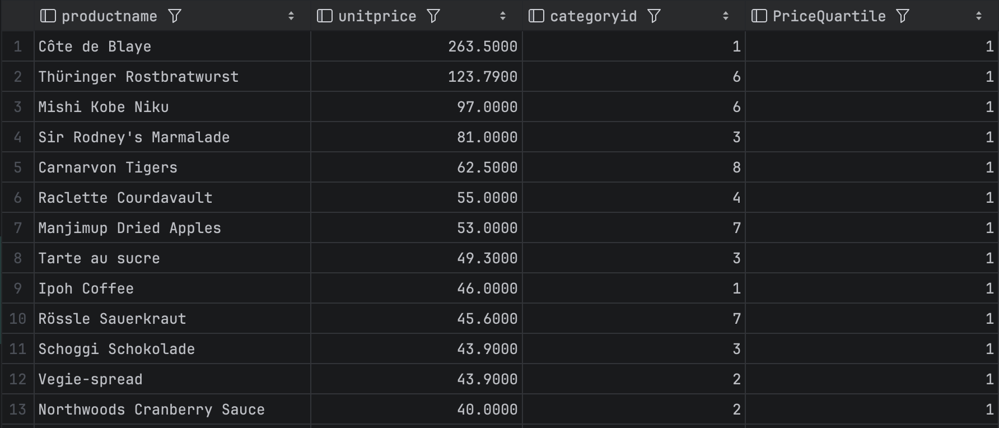
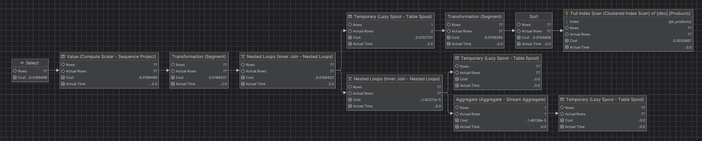
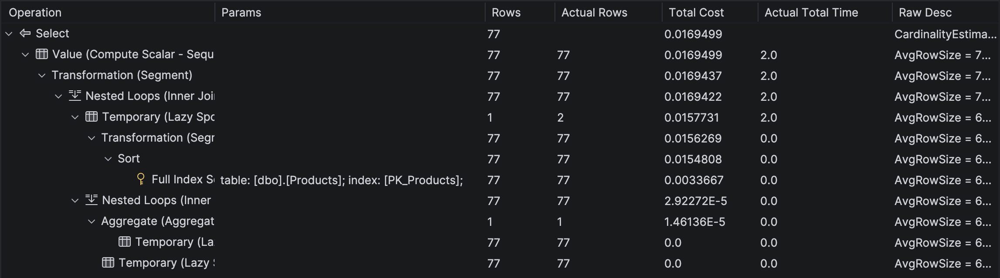


```sql
/* Analiza 8.2: Gdzie cena produktu znajduje się na tle konkurencji w swojej kategorii? */
SELECT 
    productname, 
    unitprice,
    categoryid,
    ROUND(PERCENT_RANK() OVER(PARTITION BY categoryid ORDER BY unitprice), 2) AS PercentileRank,
    ROUND(CUME_DIST() OVER(PARTITION BY categoryid ORDER BY unitprice), 2) AS CumulativeDist
FROM products;
```
>77 rows retrieved starting from 1 in 333 ms (execution: 9 ms, fetching: 324 ms)

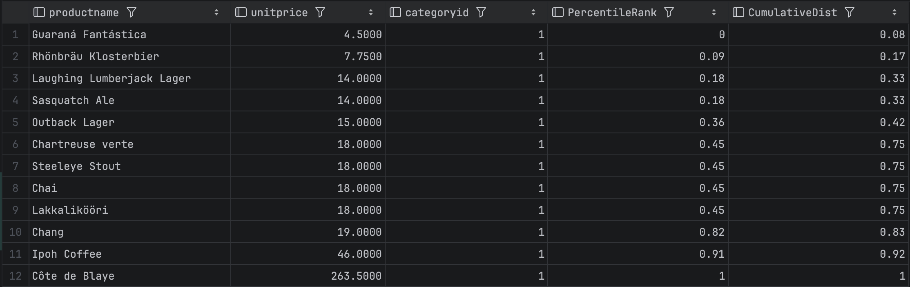
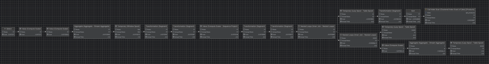
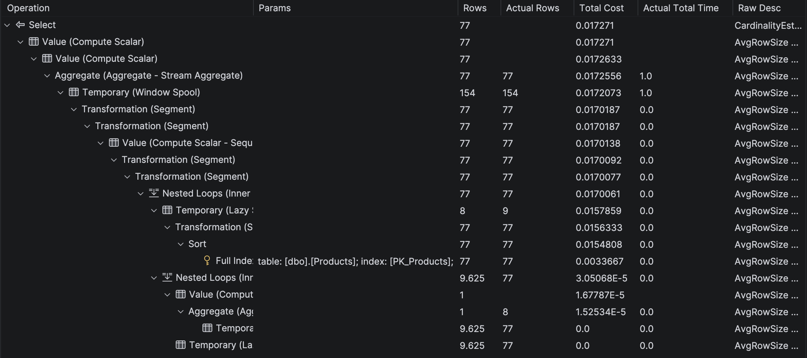


```sql
/* Analiza 8.3: Porównanie ceny produktu z medianą w danej kategorii */
SELECT 
    productname, 
    unitprice, 
    categoryid,
    PERCENTILE_CONT(0.5) WITHIN GROUP (ORDER BY unitprice) 
        OVER (PARTITION BY categoryid) AS CategoryMedianPrice
FROM products;
```

>77 rows retrieved starting from 1 in 347 ms (execution: 13 ms, fetching: 334 ms)

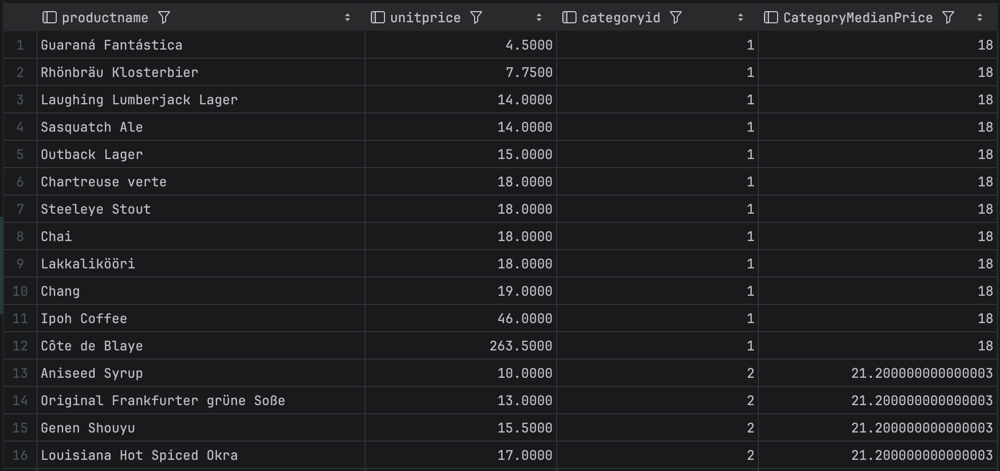
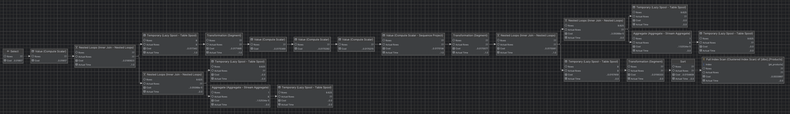
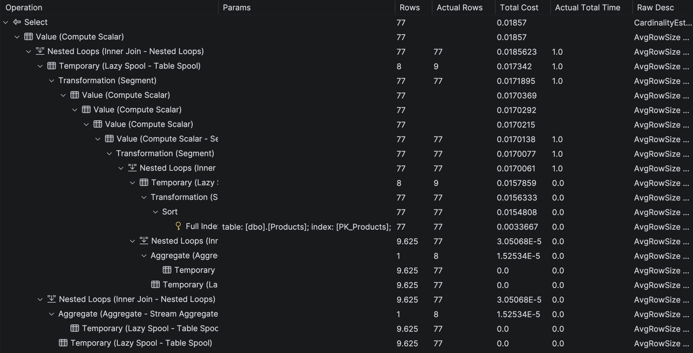

>Wnioski: Zaawansowane funkcje okienkowe (takie jak `NTILE`, `PERCENT_RANK` czy `PERCENTILE_CONT`) są wysokowydajnymi narzędziami analitycznymi, które mimo wizualnej złożoności planów wykonania pozwalają na realizację skomplikowanych obliczeń statystycznych bezpośrednio w warstwie bazy danych, co eliminuje potrzebę transferu danych do zewnętrznych narzędzi i drastycznie skraca czas procesów analitycznych w porównaniu do ręcznych implementacji z użyciem tabel tymczasowych czy złączeń.


---
Punktacja

|         |     |
| ------- | --- |
| zadanie | pkt |
| 1       | 1   |
| 2       | 2   |
| 3       | 1   |
| 4       | 1   |
| 5       | 1   |
| 6       | 1   |
| 7       | 2   |
| 8       | 2   |
| razem   | 11  |
