# Indeksy,  optymalizator <br>Lab1

<!-- <style scoped>
 p,li {
    font-size: 12pt;
  }
</style>  -->

<!-- <style scoped>
 pre {
    font-size: 8pt;
  }
</style>  -->


---

**Imiona i nazwiska: Jan Małek**

--- 

Celem ćwiczenia jest zapoznanie się z planami wykonania zapytań (execution plans), oraz z budową i możliwością wykorzystaniem indeksów.

Swoje odpowiedzi wpisuj w miejsca oznaczone jako:

---
> Wyniki: 

```sql
--  ...
```

---

Ważne/wymagane są komentarze.

Zamieść kod rozwiązania oraz zrzuty ekranu pokazujące wyniki
- dołącz kod rozwiązania w formie tekstowej/źródłowej
- najlepiej plik  .md 
	- ewentualnie sql

Zwróć uwagę na formatowanie kodu

## Oprogramowanie - co jest potrzebne?

Do wykonania ćwiczenia potrzebne jest następujące oprogramowanie
- MS SQL Server
- SSMS - SQL Server Management Studio    
	- ewentualnie inne narzędzie umożliwiające komunikację z MS SQL Server i analizę planów zapytań
- przykładowa baza danych AdventureWorks2017.
    
Oprogramowanie dostępne jest na przygotowanej maszynie wirtualnej


## Przygotowanie  
    
Stwórz swoją bazę danych o nazwie lab1. 

```sql
create database lab1  
go  
  
use lab1 
go
```


# Część 1

Celem tej części ćwiczenia jest zapoznanie się z planami wykonania zapytań (execution plans) oraz narzędziem do automatycznego generowania indeksów.

## Dokumentacja/Literatura

Przydatne materiały/dokumentacja. Proszę zapoznać się z dokumentacją:
- [https://docs.microsoft.com/en-us/sql/tools/dta/tutorial-database-engine-tuning-advisor](https://docs.microsoft.com/en-us/sql/tools/dta/tutorial-database-engine-tuning-advisor)
- [https://docs.microsoft.com/en-us/sql/relational-databases/performance/start-and-use-the-database-engine-tuning-advisor](https://docs.microsoft.com/en-us/sql/relational-databases/performance/start-and-use-the-database-engine-tuning-advisor)
- [https://www.simple-talk.com/sql/performance/index-selection-and-the-query-optimizer](https://www.simple-talk.com/sql/performance/index-selection-and-the-query-optimizer)
- [https://blog.quest.com/sql-server-execution-plan-what-is-it-and-how-does-it-help-with-performance-problems/](https://blog.quest.com/sql-server-execution-plan-what-is-it-and-how-does-it-help-with-performance-problems/)


Operatory (oraz reprezentujące je piktogramy/Ikonki) używane w graficznej prezentacji planu zapytania opisane są tutaj:
- [https://docs.microsoft.com/en-us/sql/relational-databases/showplan-logical-and-physical-operators-reference](https://docs.microsoft.com/en-us/sql/relational-databases/showplan-logical-and-physical-operators-reference)

<div style="page-break-after: always;"></div>


Wykonaj poniższy skrypt, aby przygotować dane:

```sql
select * into [salesorderheader]  
from [adventureworks2017].sales.[salesorderheader]  
go  
  
select * into [salesorderdetail]  
from [adventureworks2017].sales.[salesorderdetail]  
go
```


# Zadanie 1 - Obserwacja


Wpisz do MSSQL Managment Studio (na razie nie wykonuj tych zapytań):

```sql
-- zapytanie 1  
select *  
from salesorderheader sh  
inner join salesorderdetail sd on sh.salesorderid = sd.salesorderid  
where orderdate = '2008-06-01 00:00:00.000'  
go  

-- zapytanie 1.1
select *  
from salesorderheader sh  
inner join salesorderdetail sd on sh.salesorderid = sd.salesorderid  
where orderdate = '2013-01-28 00:00:00.000' 
go  
  
-- zapytanie 2  
select orderdate, productid, sum(orderqty) as orderqty, 
       sum(unitpricediscount) as unitpricediscount, sum(linetotal)  
from salesorderheader sh  
inner join salesorderdetail sd on sh.salesorderid = sd.salesorderid  
group by orderdate, productid  
having sum(orderqty) >= 100  
go  
  
-- zapytanie 3  
select salesordernumber, purchaseordernumber, duedate, shipdate  
from salesorderheader sh  
inner join salesorderdetail sd on sh.salesorderid = sd.salesorderid  
where orderdate in ('2008-06-01','2008-06-02', '2008-06-03', '2008-06-04', '2008-06-05')  
go  
  
-- zapytanie 4  
select sh.salesorderid, salesordernumber, purchaseordernumber, duedate, shipdate  
from salesorderheader sh  
inner join salesorderdetail sd on sh.salesorderid = sd.salesorderid  
where carriertrackingnumber in ('ef67-4713-bd', '6c08-4c4c-b8')  
order by sh.salesorderid  
go
```


Włącz dwie opcje: **Include Actual Execution Plan** oraz **Include Live Query Statistics**:


<!-- ![[_img/index1-1.png | 500]] -->


Teraz wykonaj poszczególne zapytania (najlepiej każde analizuj oddzielnie). Co można o nich powiedzieć? Co sprawdzają? Jak można je zoptymalizować?  

1

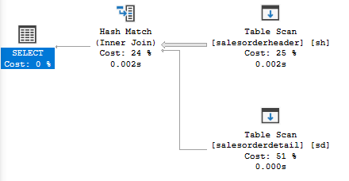

>Koszt: 2.44563

1.1

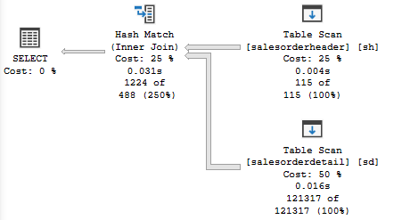

>Koszt: 2.46448

2

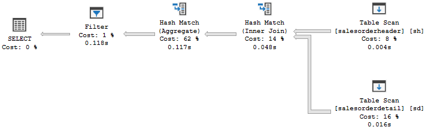

>Koszt: 7.96996

3

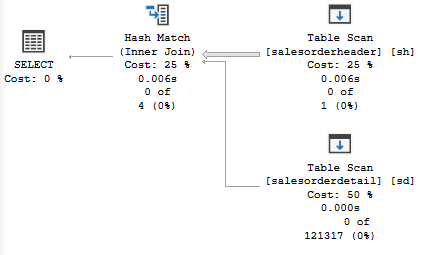

>Koszt: 2.48642

4

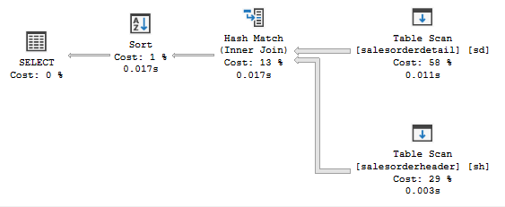

>Koszt: 2.13823

---
> Wyniki: 
>We wszystkich zapytaniach głównym operatorem pobierającym dane jest **Table Scan**. Oznacza to, że silnik bazy danych musi przeszukać każdą tabelę wiersz po wierszu, ponieważ nie posiada struktury (indeksu), która pozwoliłaby na szybkie odnalezienie konkretnych rekordów.
>
>Ponieważ tabele są skanowane w całości, koszty zapytań są stosunkowo wysokie, zwłaszcza w przypadku zapytania nr 2 (Koszt: 7.96996), gdzie dochodzi dodatkowo operacja grupowania i agregacji danych.

>Zapytania 1, 1.1 oraz 3: Sprawdzają one zamówienia dla konkretnych dat lub zakresów dat. Mimo filtrowania po kolumnie `OrderDate`, silnik wykonuje pełny skan tabeli `salesorderheader`. Różnica w kosztach między zapytaniem 1 (2.44) a 1.1 (2.46) wynika z innej liczby wierszy (krotności), które spełniają warunek i muszą zostać przesłane do dalszych etapów planu.
>
>Zapytanie 2: Jest najbardziej obciążające, ponieważ łączy filtrowanie, grupowanie (`GROUP BY`) oraz warunek na sumie (`HAVING`). Plan wykonania musi tu uwzględnić agregację, co znacznie podnosi koszt w porównaniu do prostego wybierania rekordów.
>
>Zapytanie 4: Filtruje dane po numerze śledzenia przesyłki (`CarrierTrackingNumber`). Podobnie jak w poprzednich przypadkach, brak indeksu na tej kolumnie wymusza pełny skan tabeli `salesorderdetail`.

>Optymalizacja: Stworzenie indeksów klastrowanych - Należy zdefiniować klucze główne (Primary Keys) na kolumnach `SalesOrderID` w obu tabelach, co zamieni Table Scan na znacznie szybszy Clustered Index Scan lub Seek przy łączeniu tabel.
>
>Dla zapytań 1, 1.1 i 3 warto dodać indeks na kolumnie `OrderDate`.
>
>Dla zapytania 4 kluczowe byłoby założenie indeksu na kolumnie `CarrierTrackingNumber`.


# Zadanie 2 - Dobór indeksów / optymalizacja

Do wykonania tego ćwiczenia potrzebne jest narzędzie SSMS


Zapytania 1, 2, 3, 4 z  poprzedniego zadania 

```sql
select *  
from salesorderheader sh  
inner join salesorderdetail sd on sh.salesorderid = sd.salesorderid  
where orderdate = '2008-06-01 00:00:00.000'  
go  
  
-- zapytanie 2  
select orderdate, productid, sum(orderqty) as orderqty, 
       sum(unitpricediscount) as unitpricediscount, sum(linetotal)  
from salesorderheader sh  
inner join salesorderdetail sd on sh.salesorderid = sd.salesorderid  
group by orderdate, productid  
having sum(orderqty) >= 100  
go  
  
-- zapytanie 3  
select salesordernumber, purchaseordernumber, duedate, shipdate  
from salesorderheader sh  
inner join salesorderdetail sd on sh.salesorderid = sd.salesorderid  
where orderdate in ('2008-06-01','2008-06-02', '2008-06-03', '2008-06-04', '2008-06-05')  
go  
  
-- zapytanie 4  
select sh.salesorderid, salesordernumber, purchaseordernumber, duedate, shipdate  
from salesorderheader sh  
inner join salesorderdetail sd on sh.salesorderid = sd.salesorderid  
where carriertrackingnumber in ('ef67-4713-bd', '6c08-4c4c-b8')  
order by sh.salesorderid  
go

```


Zaznacz wszystkie zapytania, i uruchom je w **Database Engine Tuning Advisor**:

<!-- ![[_img/index1-12.png | 500]] -->


Sprawdź zakładkę **Tuning Options**, co tam można skonfigurować?

---
> Wyniki:
>
>Limit tuning time: Ustalenie maksymalnego czasu trwania procesu analizy wykonywanego przez narzędzie.
>
>Physical Design Structures: Określenie rodzaju struktur, które DTA ma uwzględnić w rekomendacjach, w tym indeksów klastrowanych, nieklastrowanych oraz widoków zindeksowanych.
>
>Partitioning strategy: Wybór preferowanej metody podziału tabel na partycje.
>
>Physical Design Structures to keep in database: Decyzja o zachowaniu dotychczasowych struktur lub przyzwolenie optymalizatorowi na ich usunięcie w celu poprawy wydajności.

---


Użyj **Start Analysis**:

<!-- ![[_img/index1-3.png | 500]] -->


Zaobserwuj wyniki w **Recommendations**.

Przejdź do zakładki **Reports**. Sprawdź poszczególne raporty. Główną uwagę zwróć na koszty i ich poprawę:


<!-- ![[_img/index4-1.png | 500]] -->


Zapisz poszczególne rekomendacje:

Uruchom zapisany skrypt w Management Studio.

Opisz, dlaczego dane indeksy zostały zaproponowane do zapytań:

---
> Wyniki:
> 
>Narzędzie wykazało znaczną redukcję kosztów zapytań po wdrożeniu sugerowanych zmian:
>
>Efektywność filtrowania (WHERE): Ze względu na częste filtrowanie danych po kolumnach OrderDate oraz CarrierTrackingNumber, zaproponowano indeksy umożliwiające wykonanie operacji Index Seek. Pozwala to na bezpośrednie dotarcie do danych zamiast czasochłonnego przeglądania wszystkich rekordów metodą Table Scan lub Clustered Index Scan.
>
>Wsparcie dla złączeń (JOIN): Rekomendacje uwzględniają optymalizację łączenia tabel SalesOrderHeader i SalesOrderDetail, które opiera się na kluczu SalesOrderID.

---


Sprawdź jak zmieniły się Execution Plany. Opisz zmiany:

---
> Wyniki:
>
>Po nałożeniu indeksów w strukturze planów zapytań zaszły kluczowe modyfikacje:
>
>Zmiana typu dostępu: Kosztowne operacje pełnego skanowania (Table Scan / Clustered Index Scan) zostały wyparte przez precyzyjne wyszukiwanie nieklastrowane (Index Seek). Umożliwia to serwerowi błyskawiczną lokalizację konkretnych wierszy.
>
>Redukcja kosztu relatywnego: Relatywny udział poszczególnych zapytań w całym wsadzie (Query cost relative to the batch) uległ drastycznemu obniżeniu. Operacje, które wcześniej były najbardziej obciążające dla systemu, stały się po optymalizacji znacznie mniej zasobożerne.

---

# Część 2

Celem ćwiczenia jest zapoznanie się z różnymi rodzajami  indeksów  oraz możliwością ich wykorzystania

## Dokumentacja/Literatura

Przydatne materiały/dokumentacja. Proszę zapoznać się z dokumentacją:
- [https://docs.microsoft.com/en-us/sql/relational-databases/indexes/indexes](https://docs.microsoft.com/en-us/sql/relational-databases/indexes/indexes)
- [https://docs.microsoft.com/en-us/sql/relational-databases/sql-server-index-design-guide](https://docs.microsoft.com/en-us/sql/relational-databases/sql-server-index-design-guide)
- [https://www.simple-talk.com/sql/performance/14-sql-server-indexing-questions-you-were-too-shy-to-ask/](https://www.simple-talk.com/sql/performance/14-sql-server-indexing-questions-you-were-too-shy-to-ask/)
- [https://www.sqlshack.com/sql-server-query-execution-plans-examples-select-statement/](https://www.sqlshack.com/sql-server-query-execution-plans-examples-select-statement/)

# Zadanie 3 - Indeksy klastrowane I nieklastrowane


Skopiuj tabelę `Customer` do swojej bazy danych:

```sql
select * into customer from adventureworks2017.sales.customer
```

Wykonaj analizy zapytań:

```sql
select * from customer where storeid = 594  
  
select * from customer where storeid between 594 and 610
```

Zanotuj czas zapytania oraz jego koszt koszt:

1
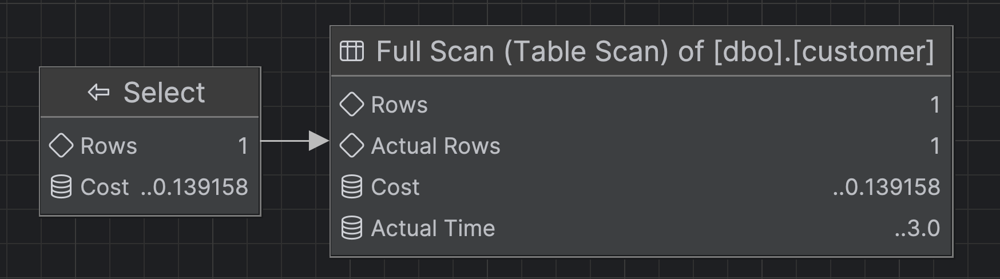
```
Koszt: 0.139158
completed in 18 ms
```
2
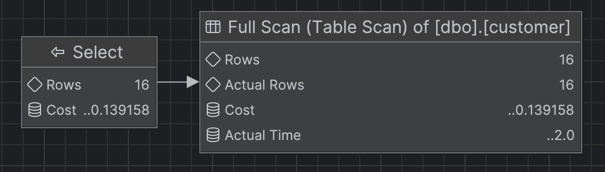
```
Koszt: 0.139158
completed in 16 ms
```

---


>Wynik: W obu przypadkach występuje pełne skanowanie tabeli, przez co koszt i czas operacji są identyczne mimo różnej liczby zwracanych wierszy. Przy tak niskiej złożoności różnice w czasie są niemierzalne, jednak brak indeksów sprawia, że jest to najmniej wydajny sposób dostępu do danych w porównaniu z kolejnymi przykładami.


Dodaj indeks:

```sql
create  index customer_store_cls_idx on customer(storeid)
```

Jak zmienił się plan i czas? Czy jest możliwość optymalizacji?

1
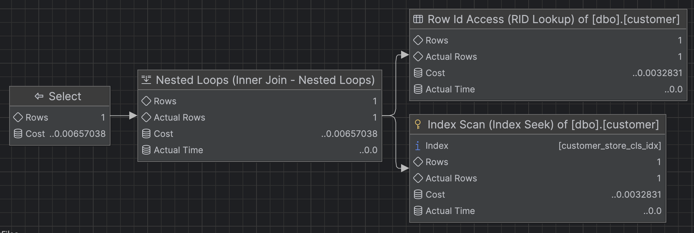
```
Koszt: 0.0065704
completed in 12 ms
```

2
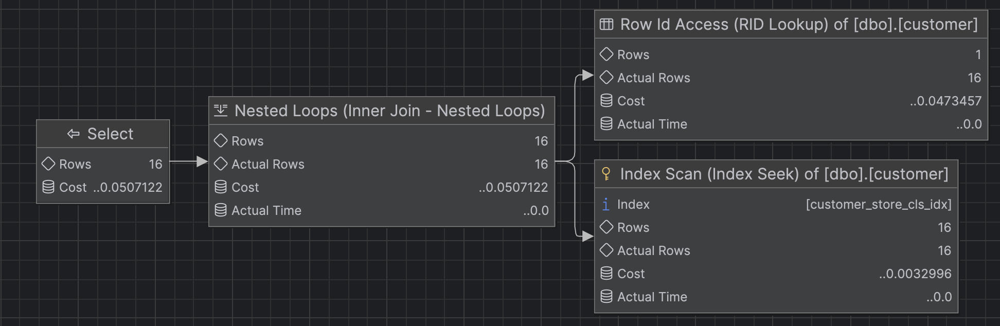
```
Koszt: 0.0507122
completed in 14 ms
```

---
> Wyniki: Wprowadzenie indeksu znacząco zredukowało koszt zapytania, a w planie pojawił się operator Nested Loops, który efektywnie łączy dane partiami. Rozwiązanie to sprawdza się przy mniejszej liczbie rekordów, co widać po niższym koszcie pierwszego podzapytania.


Dodaj indeks klastrowany:

```sql
create clustered index customer_store_cls_idx on customer(storeid)
```

Czy zmienił się plan/koszt/czas? Skomentuj dwa podejścia w wyszukiwaniu krotek.

1
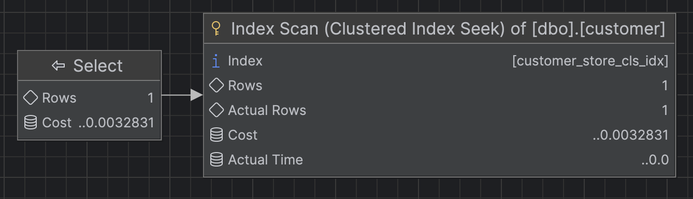
```
Koszt: 0.0032831
completed in 13 ms
```

2
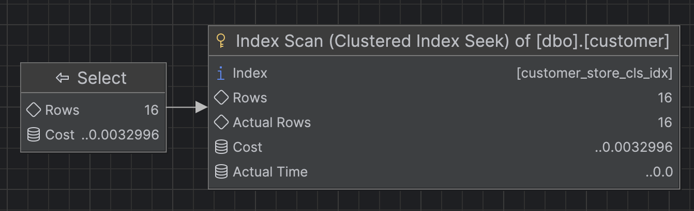
```
Koszt: 0.0032996
completed in 13 ms
```
---
> Wyniki: Wyniki ponownie znacząco się poprawiły - koszt zapytań spadł, szczególnie dla zapytania zakresowego. Plan wykonania zmienił się tak, że baza danych bezpośrednio wyszukuje dane w uporządkowanym indeksie klastrowanym, bez przeszukiwania całej tabeli.

**Wnioski**
>Różnica między tymi podejściami wynika z architektury dostępu do danych. Indeks nieklastrowany sprawnie lokalizuje kolumnę `storeid`, jednak wymaga wykonania operacji dociągnięcia pozostałych atrybutów z tabeli głównej (tzw. Lookup). W przypadku szerokich zakresów danych, jak w operatorze `BETWEEN`, generuje to dużą liczbę nadmiarowych operacji wejścia/wyjścia i podnosi koszt zapytania. Z kolei indeks klastrowy jest wydajniejszy, ponieważ dane są w nim składowane fizycznie wraz z kluczem indeksu. Dzięki temu po znalezieniu szukanej wartości system ma natychmiastowy dostęp do całego rekordu, co znacząco redukuje koszt i czas operacji na dużych zbiorach danych.

# Zadanie 4 - dodatkowe kolumny w indeksie

Celem zadania jest porównanie indeksów zawierających dodatkowe kolumny.

Skopiuj tabelę `Address` do swojej bazy danych:

```sql
select * into address from  adventureworks2017.person.address
```

W tej części będziemy analizować następujące zapytanie:

```sql
select addressline1, addressline2, city, stateprovinceid, postalcode  
from address  
where postalcode between '98000' and '99999'
```

```sql
create index address_postalcode_1  
on address (postalcode)  
include (addressline1, addressline2, city, stateprovinceid);  
go  
  
create index address_postalcode_2  
on address (postalcode, addressline1, addressline2, city, stateprovinceid);  
go
```


Czy jest widoczna różnica w planach/kosztach zapytań? 
- w sytuacji gdy nie ma indeksów
- przy wykorzystaniu indeksu:
	- address_postalcode_1
	- address_postalcode_2

Jeśli tak to jaka? 

Aby wymusić użycie indeksu użyj `WITH(INDEX(Address_PostalCode_1))` po `FROM`

```sql
select addressline1, addressline2, city, stateprovinceid, postalcode
from address  WITH(INDEX(Address_PostalCode_1))
where postalcode between '98000' and '99999'


select addressline1, addressline2, city, stateprovinceid, postalcode
from address  WITH(INDEX(Address_PostalCode_2))
where postalcode between '98000' and '99999'
```

1 Bez indeksu
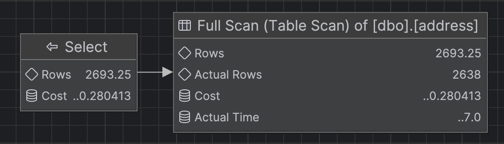
```
Koszt: 0.280413
completed in 19 ms
```

2 address_postalcode_1:
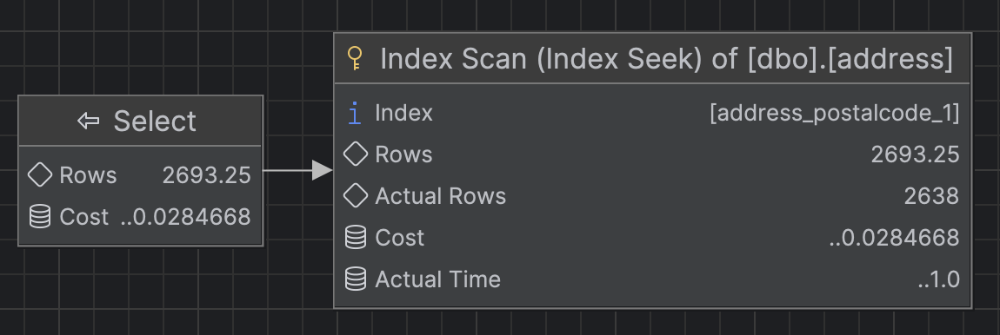
```
Koszt: 0.0284668
completed in 13 ms
```

3 address_postalcode_2:
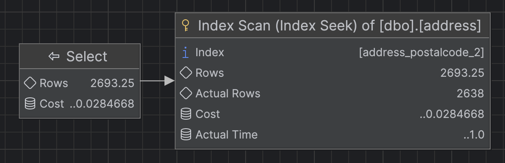
```
Koszt: 0.0284668
completed in 11 ms
```
> Wyniki: Brak indeksowania wymusza pełne skanowanie tabeli, co generuje koszty o rząd wielkości wyższe niż w przypadku zastosowania struktur pomocniczych. Oba przygotowane indeksy wykorzystują operację Index Scan, a ich plany wykonania pozostają identyczne.


Sprawdź rozmiar Indeksów:

```sql
select i.name as indexname, sum(s.used_page_count) * 8 as indexsizekb  
from sys.dm_db_partition_stats as s  
inner join sys.indexes as i on s.object_id = i.object_id and s.index_id = i.index_id  
where i.name = 'address_postalcode_1' or i.name = 'address_postalcode_2'  
group by i.name  
go
```


Który jest większy? Jak można skomentować te dwa podejścia do indeksowania? Które kolumny na to wpływają?

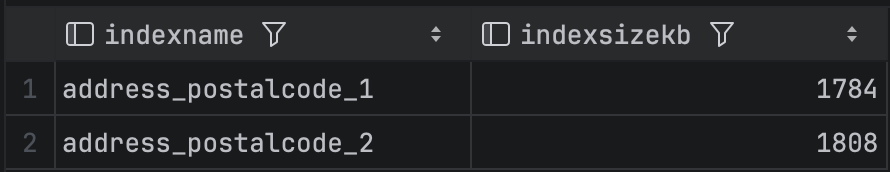

> Wyniki: Indeks drugi cechuje się większym rozmiarem (1808 KB), co wynika z faktu, że wszystkie kolumny zostały włączone bezpośrednio do jego klucza. W przypadku pierwszego indeksu (1784 KB) zastosowano klauzulę **INCLUDE**, dzięki której w strukturze klucza znajduje się tylko jedna kolumna, co pozwala na oszczędność miejsca. Biorąc pod uwagę identyczną wydajność obu rozwiązań na testowanym zbiorze, bardziej optymalnym wyborem jest mniejszy indeks pierwszy.


# Zadanie 5  - kolejność atrybutów


Skopiuj tabelę `Person` do swojej bazy danych:

```sql
select businessentityid  
      ,persontype  
      ,namestyle  
      ,title  
      ,firstname  
      ,middlename  
      ,lastname  
      ,suffix  
      ,emailpromotion  
      ,rowguid  
      ,modifieddate  
into person  
from adventureworks2017.person.person
```
---

Wykonaj analizę planu dla trzech zapytań:

```sql
select * from [person] where lastname = 'Agbonile'  
  
select * from [person] where lastname = 'Agbonile' and firstname = 'Osarumwense'  
  
select * from [person] where firstname = 'Osarumwense'
```

Co można o nich powiedzieć?

1
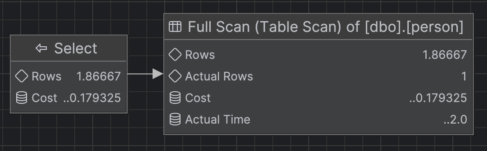
```
Koszt: 0.179325
completed in 14 ms
```

2
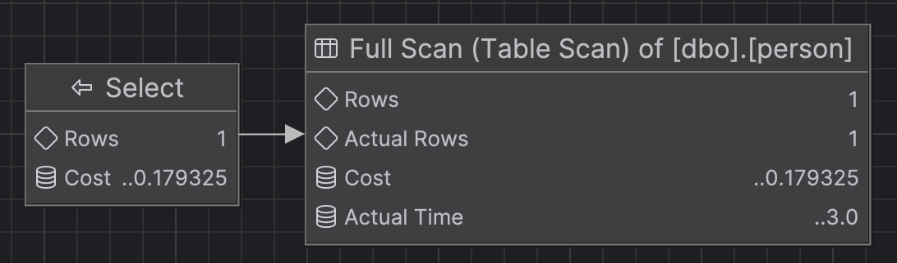
```
Koszt: 0.179325
completed in 16 ms
```

3
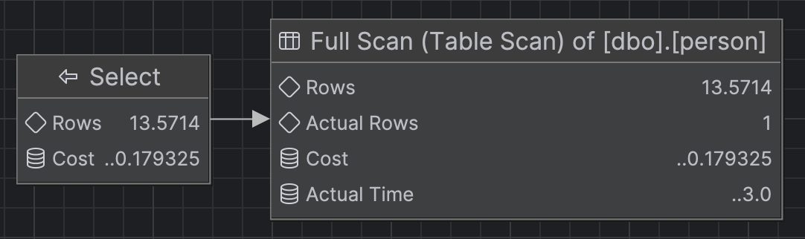
```
Koszt: 0.179325
completed in 12 ms
```

---
> Wyniki: Na podstawie dostarczonych planów wykonania można stwierdzić, że wszystkie trzy zapytania działają w sposób identyczny i nieoptymalny, wykonując pełne skanowanie tabeli. Posiadaja stały koszt operacyjny wynoszączy **0.179325**, niezależnie od filtrowanych parametrów. Róznia sie jedynie długością wierszy.


Przygotuj indeks obejmujący te zapytania:

```sql
create index person_first_last_name_idx  
on person(lastname, firstname)
```

Sprawdź plan zapytania. Co się zmieniło?

1
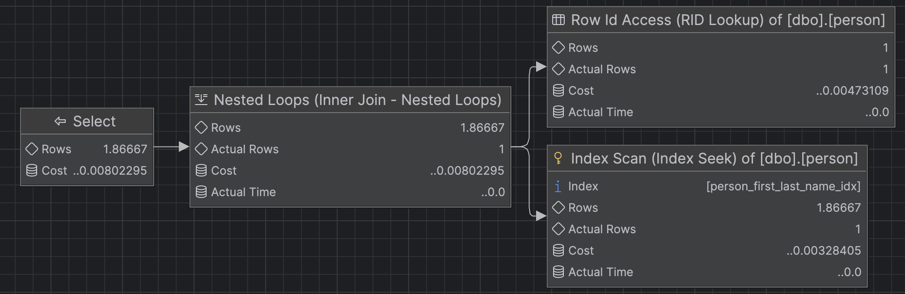
```
Koszt: 0.00802295
completed in 12 ms
```

2
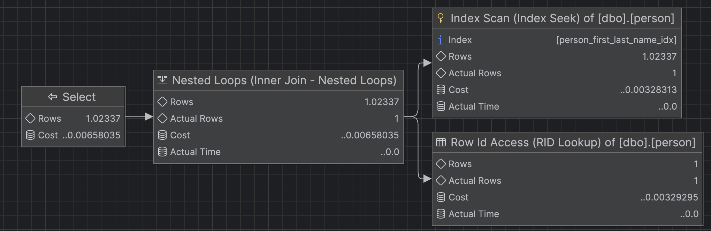
```
Koszt zapytania: 0.00658035
completed in 16 ms
```

3
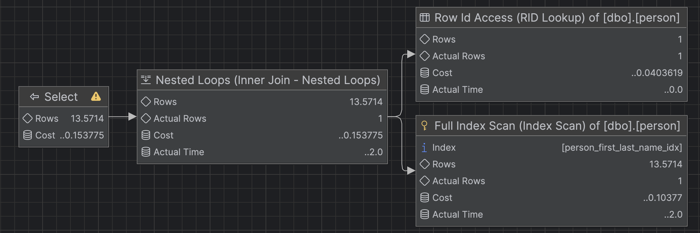
```
Koszt: 0.153775
completed in 12 ms
```

---
> Zapytania 1 i 2: Koszt zapytania drastycznie spadł, a operator Table Scan został zastąpiony przez Index Seek. Ponieważ lastname jest pierwszą kolumną w indeksie, silnik może szybko namierzyć konkretne rekordy.

> Zapytanie 3: W tym przypadku zamiast Seek następuje Index Scan (przeskanowanie całego indeksu). Dzieje się tak, ponieważ filtr dotyczy kolumny firstname, która nie jest wiodącym atrybutem indeksu, co uniemożliwia bezpośrednie wyszukiwanie binarne.

>Ogólna wydajność: Zastosowanie indeksu złożonego znacząco zoptymalizowało zapytania wykorzystujące nazwisko, jednak dla zapytań filtrujących wyłącznie po imieniu struktura ta jest mniej efektywna, choć wciąż generuje niższy koszt niż pełne skanowanie całej tabeli.


Przeprowadź ponownie analizę zapytań tym razem dla parametrów: `FirstName = ‘Angela’` `LastName = ‘Price’`. (Trzy zapytania, różna kombinacja parametrów). 

Czym różni się ten plan od zapytania o `'Osarumwense Agbonile'` . Dlaczego tak jest?


1
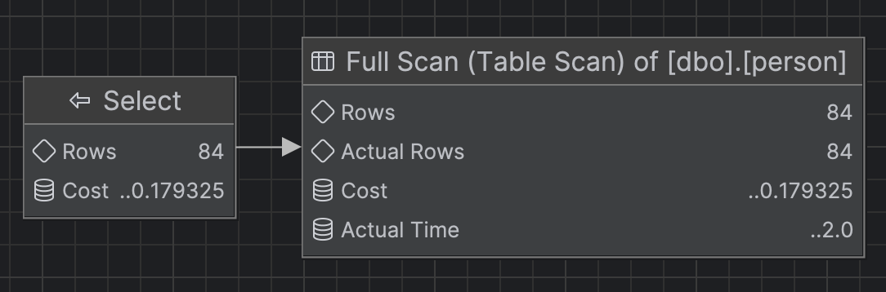
```
Koszt: 0.179325
completed in 13 ms
```

2
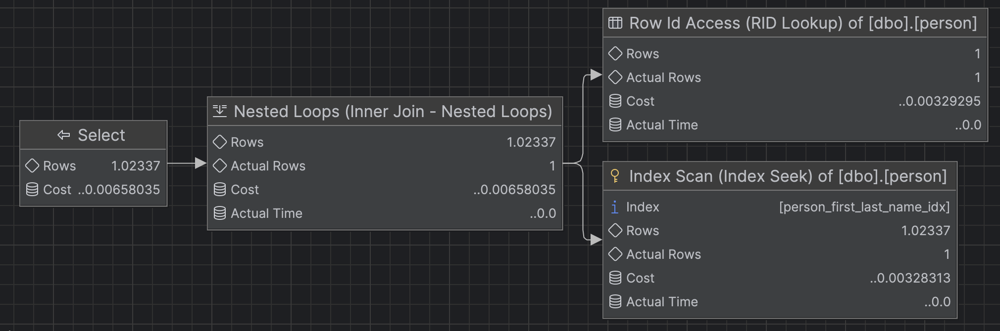
```
Koszt: 0.00658035
completed in 15 ms
```

3
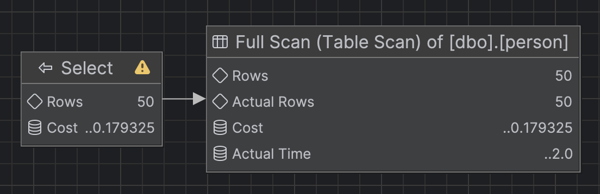
```
Koszt: 0.179325
completed in 17 ms
```

---
> Powrót do Table Scan: W zapytaniach 1 oraz 3 optymalizator całkowicie zrezygnował z indeksu na rzecz pełnego skanowania tabeli (Table Scan). Wynika to z faktu, że dla większej liczby dopasowanych wierszy (np. 84 lub 50 rekordów) koszt operacji RID Lookup byłby wyższy niż jednorazowe przeczytanie całej tabeli.

>Wykorzystanie indeksu w zapytaniu 2: Jedynie w przypadku podania obu parametrów jednocześnie silnik zdecydował się na Index Seek połączony z RID Lookup. Dodanie imienia do filtra znacząco zwiększyło selektywność zapytania, ograniczając liczbę rekordów do pobrania z tabeli głównej.

>Główną przyczyną jest tzw. Tipping Point – SQL Server na podstawie statystyk ocenia, czy bardziej opłaca się "skakać" do tabeli po brakujące kolumny za pomocą indeksu, czy przeskanować ją w całości. Dla rzadkich danych ('Agbonile') indeks jest optymalny, natomiast dla częstszych ('Price', 'Angela') skanowanie tabeli okazuje się wydajniejsze.


---

Punktacja:

|         |     |
| ------- | --- |
| zadanie | pkt |
| 1       | 2   |
| 2       | 2   |
| 3       | 2   |
| 4       | 2   |
| 5       | 2   |
| razem   | 10  |
|         |     |
