# Kolumnowe bazy danych cz. I

## Eksploracja danych, podstawowe agregacje i pierwszy benchmark PostgreSQL i

## ClickHouse

### Imię i nazwisko: Jan Małek

### Grupa: 4


### Parametry komputera:
32GB RAM
Procesor M1 Pro


## Cel ćwiczenia

- sprawdzenie poprawności działania przygotowanego środowiska,
- zapoznanie się z tabelą events,
- przećwiczenie podstawowych zapytań analitycznych SQL,
- przygotowanie pierwszych prostych wskaźników KPI,
- porównanie wyników uzyskanych w PostgreSQL i ClickHouse,
- sformułowanie pierwszych wniosków, w jakich analizach baza kolumnowa może być szczególnie
    użyteczna.

## Ważne

- Pracuj na tej samej tabeli events w obu bazach danych.
- W typowej konfiguracji na zajęciach wystarczy używać nazwy events.
- Jeżeli w Twoim kliencie SQL tabela nie jest widoczna w bieżącym kontekście, użyj pełnej nazwy:
    public.events w PostgreSQL albo ds_lab.events w ClickHouse.
- Tam, gdzie polecenie mówi o porównaniu, nie wystarczy samo uruchomienie zapytania - napisz krótko,
    czy wyniki są zgodne.
- Do każdego zadania dołącz: kod zapytania, wynik oraz wymagany komentarz.
- Nie oddawaj samych zrzutów wyników bez interpretacji.
- W kilku zadaniach możesz korzystać z zapytań startowych, ale część rozwiązań musisz samodzielnie
    rozbudować.
- Do benchmarku użyj tego samego klienta SQL dla obu baz danych.
- Być może na zajęciach zabraknie czasu na wykonanie wszystkich zadań. Pozostałe elementy należy
    dokończyć po zajęciach.

## Opis kolumn tabeli events

- event_time - czas zdarzenia,
- event_type - typ zdarzenia, np. view, cart, purchase,
- user_id - identyfikator użytkownika,
- session_id - identyfikator sesji,
- country - kraj,
- device - urządzenie,
- product_id - identyfikator produktu,
- price - cena jednostkowa,
- quantity - liczba sztuk.


## Sprawozdanie

Oddawane sprawozdanie powinno zawierać komplet rozwiązań wszystkich zadań: kod zapytań, wyniki oraz
wymagane komentarze.

- Sprawozdanie oddaj jako plik PDF albo Markdown.
- Kod SQL formatuj jako bloki kodu.
- Wyniki zapytań przedstawiaj jako tabele albo zrzuty ekranu.
- Komentarze pisz pełnymi zdaniami.
- Termin oddania: Do końca dnia poprzedzającego kolejne zajęcia

**Punktacja:** razem 10 pkt.

### 0. Gotowość do zajęć - 0 pkt

Pokaż, że środowisko jest przygotowane do pracy.

- docker compose up -d uruchamia oba kontenery bez błędów,
- docker ps pokazuje kontenery postgres i clickhouse w statusie Up,
- w obu bazach dostępna jest tabela events,
- możliwe jest połączenie z obiema bazami z poziomu klienta SQL.

**Uwaga:** brak gotowości środowiska uniemożliwia wykonanie dalszych zadań.


### 1. Pierwsze poznanie tabeli events - 1 pkt

Zapoznaj się z tabelą events w obu bazach.

- sprawdź strukturę tabeli,
- wyświetl kilka przykładowych rekordów,
- policz liczbę wierszy,
- wyznacz minimalny i maksymalny czas zdarzenia,
- sprawdź, czy w kolumnach price i quantity występują wartości NULL, jeśli występują, wskaż ich liczbę.

**Zapytania startowe:**

```sql
SELECT * FROM events LIMIT 20;
```

Struktura tabeli i kilka przykladowych rekordów
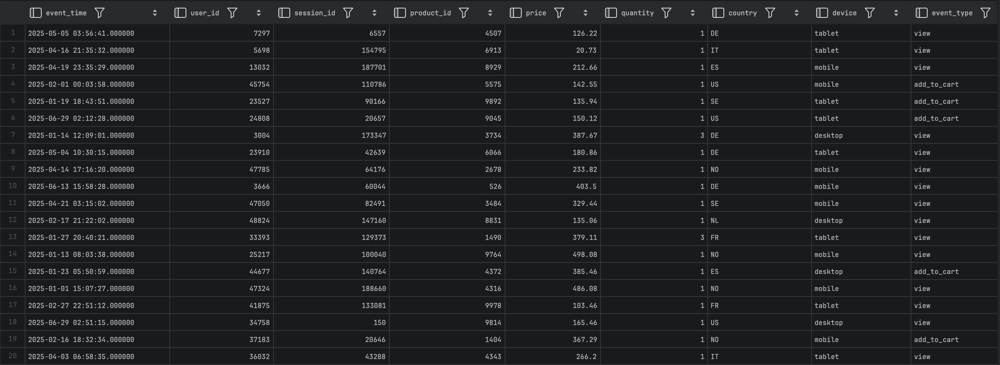


```sql
SELECT
count(*) AS n,
min(event_time) AS min_time,
max(event_time) AS max_time
FROM events;
```
Postgres
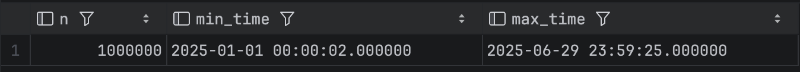

ClickHouse
<br>
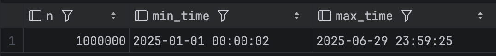

>Zakresy czasu są takie same, jedynie róznia się formatowanie. Postgres dodatkowo wyświetla czas z dokładnością do mikrosekund, ClickHouse wyświetla czas do pełnych sekund.

```sql
SELECT
count(*) AS all_rows,
count(price) AS non_null_price,
count(quantity) AS non_null_quantity,
count(*) - count(price) AS null_price_rows,
count(*) - count(quantity) AS null_quantity_rows
FROM events;
```
Postgres
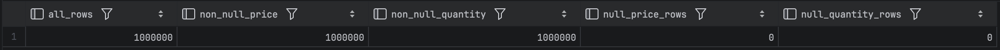

ClickHouse

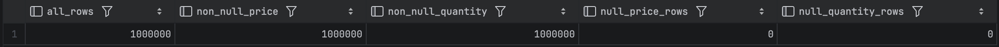

>W badanych kolumnach nie ma w wynikach NULL, co widać na załączonych tabelach. 

### 2. Profil danych zdarzeniowych - 1 pkt

Przygotuj podstawowy profil danych.

- sprawdź, jakie typy zdarzeń występują w danych i ile ich jest,
- sprawdź, jakie kraje występują w danych i ile mają zdarzeń,
- sprawdź, jakie urządzenia występują w danych i ile mają zdarzeń,
- dla każdego z tych trzech przekrojów wskaż kategorię dominującą.

**Zapytanie startowe:**

```sql
SELECT
event_type,
count(*) AS n
FROM events
GROUP BY event_type
ORDER BY n DESC;
```


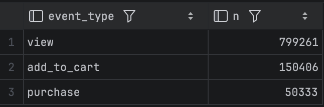

>Występują 3 typy zdarzeń: "view": 799261, "add_to_cart": 150406 oraz "purchase": 50333.

Dwa pozostałe zapytania przygotuj samodzielnie na analogicznej zasadzie.

```sql
SELECT
country,
count(*) AS n
FROM events
GROUP BY country
ORDER BY n DESC;

```

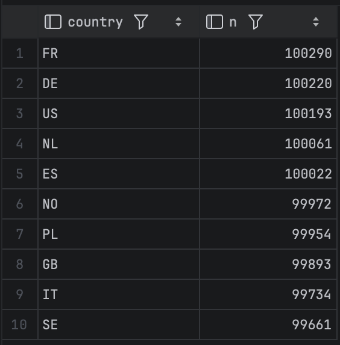

>Występuje 10 krajów, z których są uzytkownicy. Kazdy z nich posiada ok. 100tys. przypadkow. Najliczniejsza jest FR.

```sql
SELECT
device,
count(*) AS n
FROM events
GROUP BY device
ORDER BY n DESC;
```
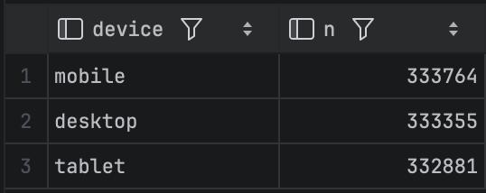

>W obu serwerach ClickHouse i Postgres wyniki wychodzą te same.

**W komentarzu:** napisz 2-3 zdania podsumowania. Nie oddawaj tylko trzech niezależnych wyników bez
wniosków.


### 3. Aktywność w czasie - 1 pkt

Sprawdź, jak zmienia się liczba zdarzeń w czasie.

- policz liczbę zdarzeń dla kolejnych dni,
- wskaż 5 dni o największej liczbie zdarzeń,
- wskaż 5 dni o najmniejszej liczbie zdarzeń,
- napisz, czy dane wyglądają na równomiernie rozłożone w czasie.

Możesz przygotować osobno: pełne zestawienie dzienne, 5 dni o największej liczbie zdarzeń oraz 5 dni o
najmniejszej liczbie zdarzeń.


```sql
-- Postgres
SELECT
    DATE(event_time) AS event_date,
    COUNT(*) AS event_count
FROM events
GROUP BY event_date
ORDER BY event_date;

-- ClickHouse
SELECT
    toDate(event_time) AS event_date,
    COUNT(*) AS event_count
FROM events
GROUP BY event_date
ORDER BY event_date;
```
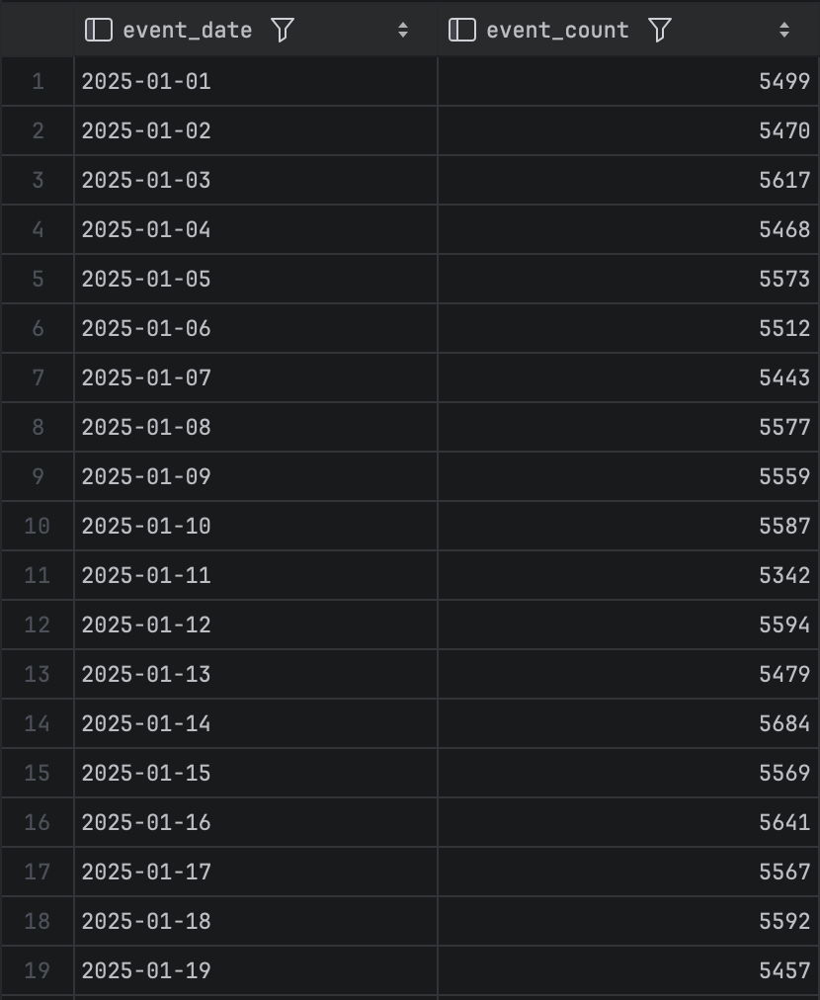

```sql
-- Postgres
SELECT
    DATE(event_time) AS event_date,
    COUNT(*) AS event_count
FROM events
GROUP BY event_date
ORDER BY event_count DESC
LIMIT  5;

-- ClickHouse
SELECT
    toDate(event_time) AS event_date,
    COUNT(*) AS event_count
FROM events
GROUP BY event_date
ORDER BY event_count DESC
LIMIT  5;
```
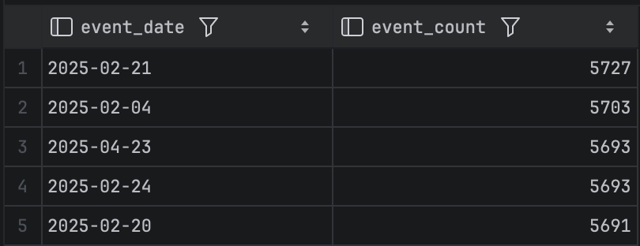


```sql
-- Postgres
SELECT
    DATE(event_time) AS event_date,
    COUNT(*) AS event_count
FROM events
GROUP BY event_date
ORDER BY event_count ASC
LIMIT  5;

-- ClickHouse
SELECT
    toDate(event_time) AS event_date,
    COUNT(*) AS event_count
FROM events
GROUP BY event_date
ORDER BY event_count ASC
LIMIT  5;

```
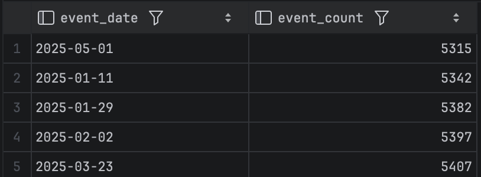

>Rozkład wygląda na stabilny róznice między, najmniejsza iloscia, a najwieksza iloscia zdarzen nie są zbyt duze (5727 do 5315). Nie ma widocznych, zadnych anomalii, odchylen.
**W komentarzu:** napisz krótko, czy rozkład wygląda stabilnie, czy są widoczne dni odstające.

### 4. Podstawowe KPI sprzedażowe - 2 pkt

Przygotuj podstawowe KPI związane ze zdarzeniami zakupowymi.

- policz liczbę zdarzeń typu purchase,
- policz łączny przychód ze zdarzeń typu purchase,
- policz średnią wartość pojedynczego zakupu,
- policz średnią liczbę sztuk w pojedynczym zakupie,
- policz liczbę sesji, w których wystąpił co najmniej jeden zakup,
- policz udział sesji zakupowych w ogólnej liczbie sesji jako uproszczony współczynnik konwersji.

**Zapytanie startowe:**

```
SELECT
count(*) AS purchases_cnt,
sum(price * quantity) AS revenue,
avg(price * quantity) AS avg_order_value,
avg(quantity) AS avg_quantity
FROM events
WHERE event_type = 'purchase';
```
Drugą część zadania - dotyczącą sesji i konwersji - przygotuj samodzielnie.


```sql
WITH stats as (
    SELECT
    count(*) AS purchases_cnt,
    sum(price * quantity) AS revenue,
    avg(price * quantity) AS avg_order_value,
    avg(quantity) AS avg_quantity,
    count(distinct session_id) AS buying_session
    FROM events
    WHERE event_type = 'purchase'
),
    total as(
        select count(distinct session_id) as all_sessions
        from events
)
select
    s.* , t.all_sessions,
    100.0 * s.buying_session / t.all_sessions AS conversion_rate_pct
from stats s, total t

```
Postgres
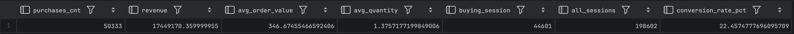

ClickHouse
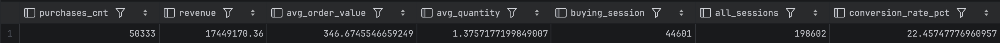

> Wyniki w obu bazach są ze sobą zgodne. Róznią się jedynie minimalnie w sposobie zaokrąglania liczb po przecinku.
> Udział sesji zakupowych lepiej opisuje konwersje, poniewaz, okresla on jaki udzial wizyt na sklepie zakonczyl sie transkacja, niezaleznie od ilosci zobaczonych produktow. Jest to najbardziej intresujaca dana w sprzedazy.


### 5. KPI w przekrojach biznesowych - 1 pkt

Policz przychód dla zdarzeń typu purchase w dwóch wybranych przekrojach:

- według kraju,
- według urządzenia,
- według dnia.
Wybierz dwa z powyższych przekrojów. Dla każdego policz przychód, posortuj wynik malejąco, wskaż
najwyższe wartości i krótko je zinterpretuj.

**Zapytanie startowe:**

```sql
SELECT
country,
sum(price * quantity) AS revenue
FROM events
WHERE event_type = 'purchase'
GROUP BY country
ORDER BY revenue DESC;
```

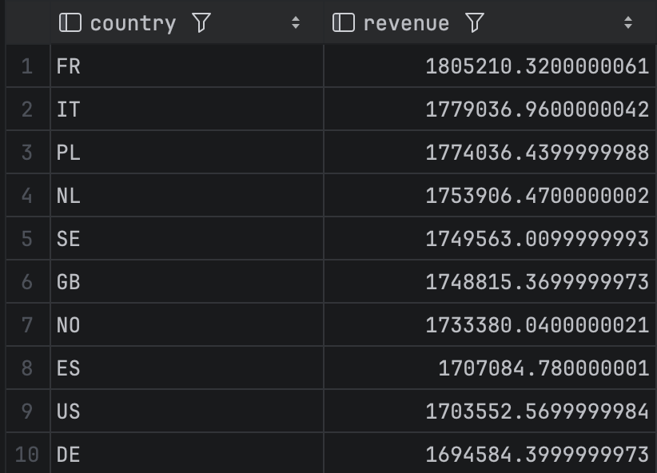

Drugie zapytanie przygotuj samodzielnie.

>Najwiekszy przychod osiagnieto dla kraju FR, co moze sie równiez wiązać z najwieksza iloscią uzytkowników z tego kraju.

```sql
SELECT
device,
sum(price * quantity) AS revenue
FROM events
WHERE event_type = 'purchase'
GROUP BY device
ORDER BY revenue DESC;
```

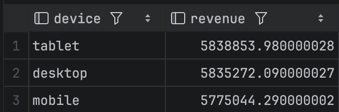

>Najwiekszy przychód osiągneły tablety, jednak generalnie są to równomiernie rozłozone statystyki.

```sql
SELECT
DATE(event_time),
sum(price * quantity) AS revenue
FROM events
WHERE event_type = 'purchase'
GROUP BY DATE(event_time)
ORDER BY revenue DESC;
```

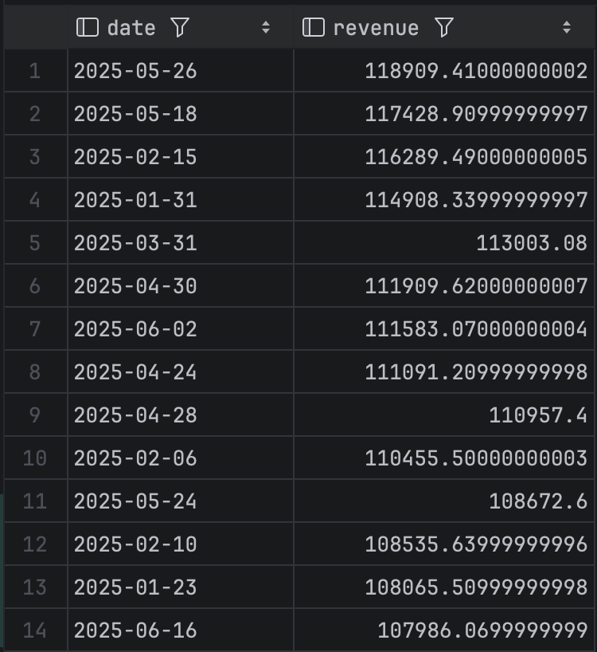

>Z tej tabeli mozna jedynie wywnioskowac, ze najwieksze przychody w losowych dniach osiągane są w pierwszej połowie roku.

### 6. Użytkownicy o najwyższym przychodzie - 1 pkt

Znajdź użytkowników o najwyższym łącznym przychodzie z zakupów.

Wynik powinien zawierać: user_id, liczbę wszystkich zdarzeń użytkownika, liczbę zdarzeń typu purchase,

łączny przychód użytkownika ze zdarzeń typu purchase. Pokaż co najmniej 20 rekordów o najwyższym
przychodzie.

**Ważne:** Przychód licz tylko dla zdarzeń typu purchase.

**Wskazówka:** W tym zadaniu przydatne może być warunkowe zliczanie i warunkowe sumowanie.

**Zapytanie startowe do uzupełnienia:**

```sql
SELECT
user_id,
count(*) AS all_events,
... AS purchase_events,
... AS revenue
FROM events
GROUP BY user_id
ORDER BY revenue DESC
LIMIT 20;
```
**W komentarzu napisz:**

- czy użytkownik z najwyższym przychodem ma też największą liczbę wszystkich zdarzeń,
- czy duża aktywność użytkownika zawsze oznacza wysoki przychód,
- jakie wnioski można wyciągnąć z porównania liczby zdarzeń i przychodu.

```sql
SELECT
user_id,
count(*) AS all_events,
count(case when event_type='purchase' then 1 end) AS purchase_events,
sum(case when event_type='purchase' then price*quantity else 0 end) AS revenue
FROM events
GROUP BY user_id
ORDER BY revenue DESC
LIMIT 20;
```

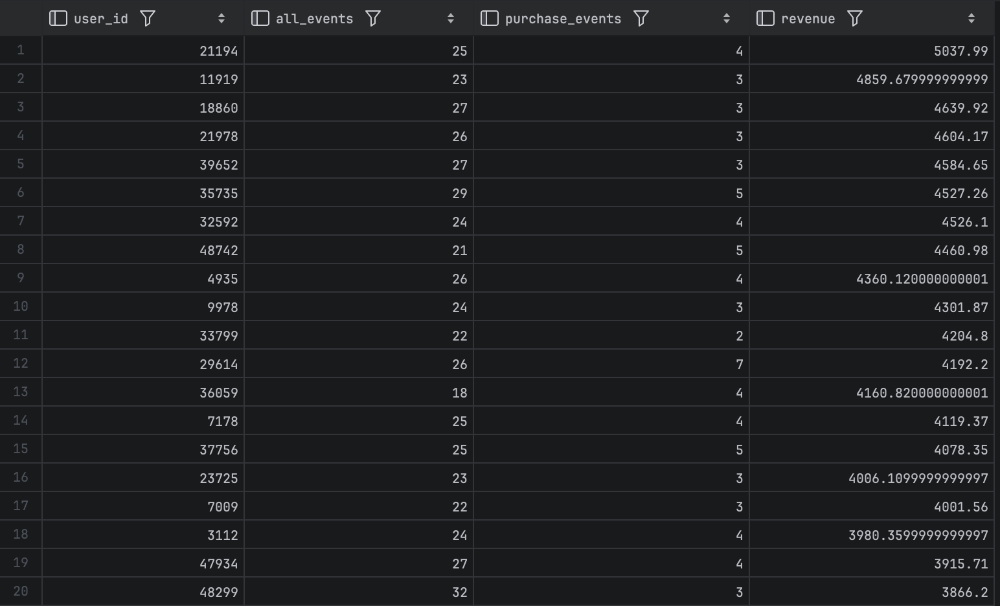


>Uzytkownik z najwiekszym przychodem nie ma największej liczby zdarzeń. Nie zawsze duza aktywność uzytkownika oznacza duzy przychod, np uzytkownik w wierszu 20, ma wszystkich wejsc 32,a jednak nie jest na przodzie tabeli i jego przychod jest o ponad 1000 nizszy od 1 miesca. Dodatkowo roznica miedzy wszystkimi eventami, a tymi zakupowymi jest duza. Mozna rozroznic uzytkownikow, ktorzy nie potrzebuja duzej ilosci wejsc, od tych ktorzy dluzej zastanawiaja sie nad zakupem.

### 7. Benchmark zapytań w PostgreSQL i ClickHouse - 3 pkt

W tym zadaniu wykonasz prosty benchmark zapytań w PostgreSQL i ClickHouse, aby porównać działanie obu
systemów dla zapytań prostszych i bardziej złożonych agregacyjnie. Szczegóły zostały opisane w częściach A,
B i C.

**Sposób pomiaru**

Dla każdego benchmarkowanego zapytania:

- uruchom zapytanie w PostgreSQL i w ClickHouse,
- wykonaj każde zapytanie 4 razy w każdej bazie,
- pierwszy pomiar pomiń jako rozgrzewkowy,
- zapisz czasy z trzech kolejnych uruchomień,
- podaj średni czas wykonania dla każdej bazy.
Czas odczytaj z klienta SQL, którego używasz na zajęciach.

**Uwaga:** nie benchmarkuj zapytań zwracających bardzo duży wynik bez LIMIT, ponieważ czas prezentacji
danych w kliencie SQL może zaburzać porównanie.

**Prezentacja wyników**

Wyniki benchmarku przedstaw w zwartej tabeli. Tabela powinna zawierać co najmniej: nazwę zapytania,
PostgreSQL - pomiar 1, pomiar 2, pomiar 3, średnia, oraz ClickHouse - pomiar 1, pomiar 2, pomiar 3, średnia.

**Komentarz końcowy**

Na końcu napisz 3-5 zdań komentarza, w których odniesiesz się do następujących kwestii:

- czy wyniki liczbowe zapytań były zgodne w obu bazach?
- czy różnice czasu wykonania były małe czy wyraźne?
- przy którym typie zapytania różnica była największa?
- czy po tym ćwiczeniu można postawić wstępny wniosek, że bardziej złożone agregacje są naturalnym
    zastosowaniem systemu analitycznego takiego jak ClickHouse?

**Uwaga:** nie oczekujemy jeszcze pełnego benchmarku technicznego. Celem zadania jest pierwsze praktyczne
porównanie działania prostszych i bardziej złożonych zapytań agregujących w dwóch systemach.

**Część A. Dwa zapytania z wcześniejszych zadań**

Wybierz dwa zapytania z wcześniejszych zadań tego laboratorium i wykonaj je w obu bazach danych. Dla
każdego zapytania pokaż wynik, napisz, czy wynik liczbowy jest zgodny w PostgreSQL i ClickHouse, oraz
zapisz czas wykonania odczytany z klienta SQL.

Wybierz zapytania o różnym poziomie trudności, np. jedno prostsze zapytanie i jedno średnio złożone
zapytanie.


```sql
SELECT
count(*) AS n,
min(event_time) AS min_time,
max(event_time) AS max_time
FROM events;
```
Postgres


```
461 ms (execution: 136 ms, fetching: 325 ms)
398 ms (execution: 83 ms, fetching: 315 ms)
389 ms (execution: 72 ms, fetching: 317 ms)
```

ClickHouse
<br>


```
330 ms (execution: 9 ms, fetching: 321 ms)
337 ms (execution: 11 ms, fetching: 326 ms)
336 ms (execution: 10 ms, fetching: 326 ms)
```

```sql
WITH stats as (
    SELECT
    count(*) AS purchases_cnt,
    sum(price * quantity) AS revenue,
    avg(price * quantity) AS avg_order_value,
    avg(quantity) AS avg_quantity,
    count(distinct session_id) AS buying_session
    FROM events
    WHERE event_type = 'purchase'
),
    total as(
        select count(distinct session_id) as all_sessions
        from events
)
select
    s.* , t.all_sessions,
    100.0 * s.buying_session / t.all_sessions AS conversion_rate_pct
from stats s, total t

```
Postgres


```
928 ms (execution: 591 ms, fetching: 337 ms)
745 ms (execution: 418 ms, fetching: 327 ms)
730 ms (execution: 407 ms, fetching: 323 ms)
```


ClickHouse


```
378 ms (execution: 37 ms, fetching: 341 ms)
351 ms (execution: 31 ms, fetching: 320 ms)
458 ms (execution: 139 ms, fetching: 319 ms)
```

>Przy prostym zapytaniu widac lekka przewage ClickHouse, która staje się duzo bardziej widoczna przy bardziej złozonym zapytaniu. Czas mimo tego ze ms, jest dwukrtonie mniejszy pod Postgresa. Bardziej zlozone zapytania, sa duzo lepsze dla systemow kolumnowych, ktore wczytuja tylko potrzebne kolumny, w porownaniu do wierszowych takich jak Postgres.

**Część B. Zapytanie benchmarkowe podane przez prowadzącego**

Wykonaj w obu bazach poniższe zapytanie agregujące.

**PostgreSQL:**

```
SELECT
DATE(event_time) AS day,
country,
device,
event_type,
count(*) AS events_cnt,
count(DISTINCT user_id) AS users_cnt,
count(DISTINCT session_id) AS sessions_cnt,
sum(CASE
WHEN event_type = 'purchase' THEN price * quantity
ELSE 0
END) AS revenue
FROM events
GROUP BY
DATE(event_time),
country,
device,
event_type
ORDER BY revenue DESC
LIMIT 20;
```
**ClickHouse:**

```
SELECT
toDate(event_time) AS day,
country,
device,
event_type,
count() AS events_cnt,
count(DISTINCT user_id) AS users_cnt,
count(DISTINCT session_id) AS sessions_cnt,
sum(CASE
WHEN event_type = 'purchase' THEN price * quantity
ELSE 0
END) AS revenue
FROM events
GROUP BY
day,
country,
device,
event_type
ORDER BY revenue DESC
LIMIT 20;
```


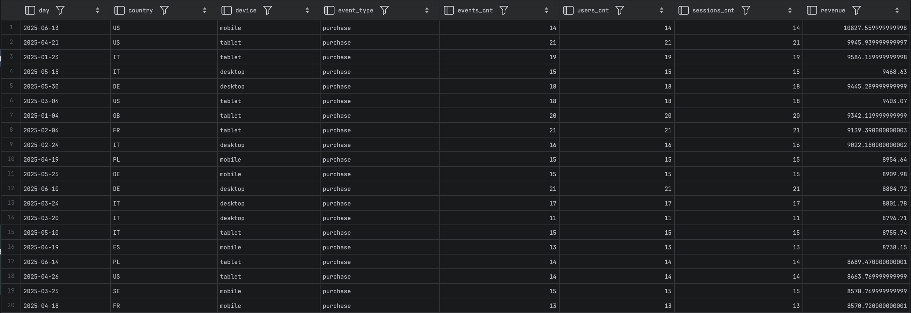

```
2 s 482 ms (execution: 2 s 98 ms, fetching: 384 ms)
2 s 348 ms (execution: 2 s 25 ms, fetching: 323 ms)
2 s 292 ms (execution: 1 s 972 ms, fetching: 320 ms)
```
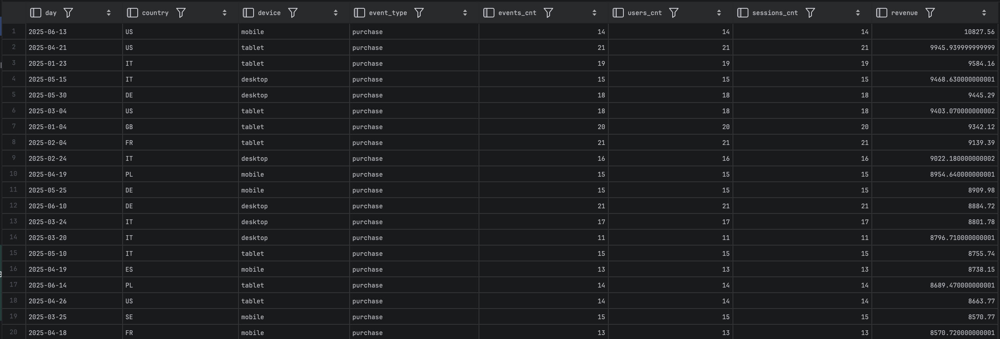

```
405 ms (execution: 67 ms, fetching: 338 ms)
384 ms (execution: 57 ms, fetching: 327 ms)
381 ms (execution: 58 ms, fetching: 323 ms)
```

Dla tego zapytania pokaż wynik z obu baz, napisz, czy wyniki są zgodne, oraz zapisz czas wykonania w
PostgreSQL i ClickHouse.

>Wyniki tak jak wczesniej, roznia sie w niektorych miejscach zaokregleniem przecinków. Czasy wykonan zdecydowanie pokazuja przewage ClickHouse w porownaniu do Postgresa, ktory jest kilka razy wolniejszy.

**Część C. Własne analogiczne zapytanie**

Na podstawie zapytania z części B przygotuj jedno własne zapytanie analogiczne, które będzie oparte na tym
samym schemacie, ale zmodyfikowane w co najmniej jednym lub dwóch elementach.

Możesz skorzystać z poniższych modyfikacji:

- ograniczyć dane tylko do zdarzeń purchase,
- usunąć jeden wymiar grupowania,
- dodać filtr dla wybranego kraju,
- dodać filtr dla wybranego urządzenia,
- zmienić zestaw liczonych miar,
- ograniczyć analizę do wybranego przedziału czasu.


Dodano ograniczenie tylko dla "purchase" i dla FR

```sql
SELECT
    DATE(event_time) AS day,
    country,
    device,
    count(*) AS purchases_cnt,
    count(DISTINCT user_id) AS unique_buyers,
    count(DISTINCT session_id) AS buying_sessions,
    sum(price * quantity) AS daily_revenue
FROM events
WHERE event_type = 'purchase'
  AND country = 'FR'
GROUP BY
    day,
    country,
    device
ORDER BY daily_revenue DESC
LIMIT 20;
```

```sql
SELECT
    toDate(event_time) AS day,
    country,
    device,
    count() AS purchases_cnt,
    uniq(user_id) AS unique_buyers,
    uniq(session_id) AS buying_sessions,
    sum(price * quantity) AS daily_revenue
FROM events
WHERE event_type = 'purchase' 
  AND country = 'FR'
GROUP BY 
    day, 
    country, 
    device
ORDER BY daily_revenue DESC
LIMIT 20;
```

Postgres
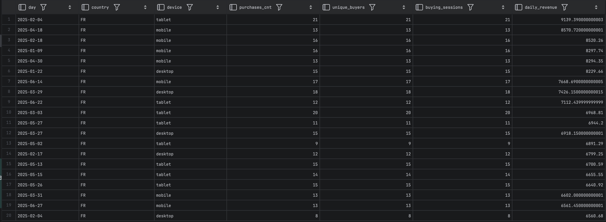

```
458 ms (execution: 117 ms, fetching: 341 ms)
420 ms (execution: 98 ms, fetching: 322 ms)
405 ms (execution: 86 ms, fetching: 319 ms)
```

ClickHouse
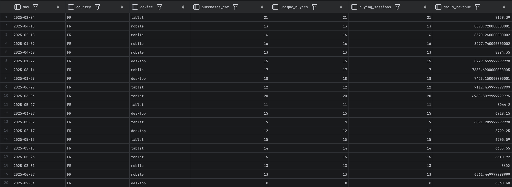
```
381 ms (execution: 32 ms, fetching: 349 ms)
347 ms (execution: 30 ms, fetching: 317 ms)
348 ms (execution: 28 ms, fetching: 320 ms)
```


>Wyniki obu baz są zgodne, czasowo ClickHouse nadal jest lepszy, jednak przy bardziej ograniczonym zbiorze te róznice czasowe nie są takie duze.
## Uwaga końcowa dla studentów

Oceniane będą:

- poprawność logiczna zapytania,
- zgodność wyników między bazami tam, gdzie jest to wymagane,
- umiejętność interpretacji wyniku,
- czytelność i sensowność kodu.
Samo uruchomienie gotowego zapytania bez zrozumienia i bez komentarza nie będzie traktowane jako pełne
rozwiązanie.


