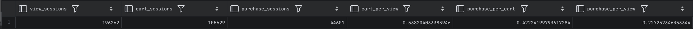
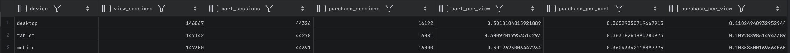
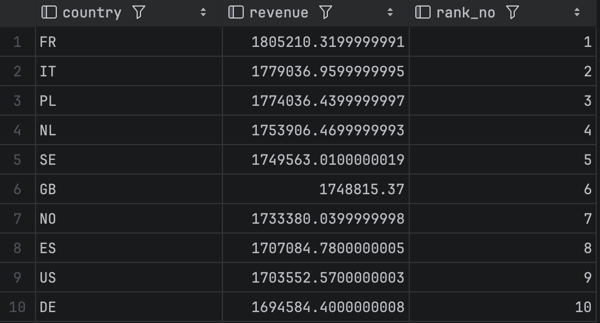
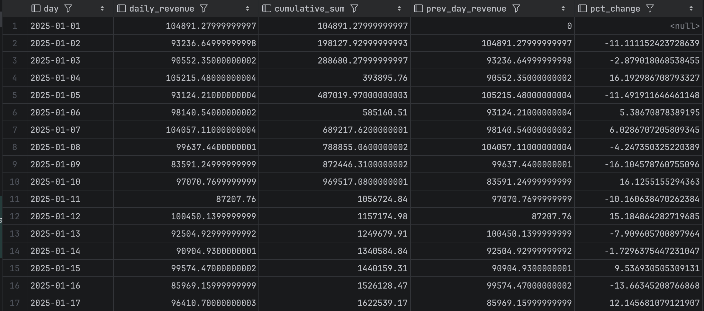
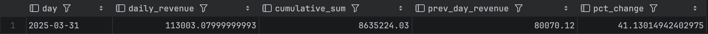

**Kolumnowe bazy danych cz. II**

**Zaawansowana analityka i dowód wydajności**

**Imię i nazwisko:**
Jan Małek
**Grupa:** 4

**Cel ćwiczenia**

Po tym laboratorium będziesz potrafił:

1.  zbudować lejek konwersji i zinterpretować odpływ między jego
    etapami,

2.  użyć funkcji okna do rankingu i analizy trendu przychodów w czasie,

3.  podzielić użytkowników na segmenty metodą RFM i wyciągnąć z tego
    wnioski biznesowe,

4.  zmierzyć i wyjaśnić różnicę wydajności między ClickHouse a
    PostgreSQL i powiedzieć, skąd ona wynika.

Laboratorium ma celowo prostą strukturę: **zadania 1–3 to analityka w
ClickHouse**, **zadanie 4 to dowód** eksperyment porównawczy oparty na
zapytaniach, które właśnie napisałeś.

**Zanim zaczniesz - przeczytaj to uważnie**

**Której bazy używamy i kiedy**

| **Zadanie**             | **Baza danych**                 |
|-------------------------|---------------------------------|
| 0\. Gotowość            | obie — sprawdzasz środowisko    |
| 1\. Lejek konwersji     | ClickHouse                      |
| 2\. Funkcje okna        | Jedna baza do wyboru            |
| 3\. Segmentacja RFM     | Do wyboru ale ClickHouse lepiej |
| 4\. Benchmark i wnioski | obie — porównanie obowiązkowe   |

W tym laboratorium ClickHouse jest bazą wiodącą. PostgreSQL pojawia się
w zadaniu 4 jako punkt odniesienia — po to, żeby różnicę wydajności
zmierzyć, nie zakładać.

**Jak korzystać ze ściągi**

Do zajęć dołączona jest ściąga sql_postgresql_clickhouse_sciaga.pdf.
Zawiera składnię i podpowiedzi do przykładów dla każdego zadania.
Korzystaj z niej jak z dokumentacji - żeby sprawdzić składnię funkcji,
nie żeby skopiować rozwiązanie. Numer sekcji ściągi podany jest przy
każdym zadaniu.

**Oceniane są interpretacja i komentarz.** Sam fakt uruchomienia
zapytania nie jest rozwiązaniem.

**Sprawozdanie**

Oddaj jako PDF albo Markdown. Dla każdego zadania dołącz:

- kod zapytania,

- wynik - tabela lub zrzut ekranu,

- komentarz - pełnymi zdaniami, nie listą słów.

**Termin oddania:** do końca dnia poprzedzającego kolejne zajęcia.

**Punktacja:** razem 10 pkt.

**Założenie startowe**

Środowisko Docker działa, tabela events jest dostępna w obu bazach.
Jeżeli tabela nie jest widoczna w bieżącym kontekście, użyj pełnej
nazwy:

- public.events w PostgreSQL,

- ds_lab.events w ClickHouse.

**0. Gotowość do zajęć — warunek konieczny (0 pkt)**

Pokaż, że środowisko działa: kontenery postgres i clickhouse mają status
Up, tabela events jest widoczna w obu bazach, połączenie z klienta SQL
działa.

**Brak gotowości środowiska** uniemożliwia wykonanie dalszych zadań.

**1. Lejek konwersji — 2 pkt**

**Dlaczego to robimy**

W e-commerce każda sesja przechodzi przez etapy: wyświetlenie → koszyk →
zakup. Na każdym etapie część sesji odpada. **Lejek konwersji** mierzy,
ile sesji przechodzi przez każdy etap i gdzie odpływ jest największy -
to fundamentalny wskaźnik analityki e-commerce. Przy okazji zobaczysz,
jak ClickHouse upraszcza agregacje warunkowe dzięki countIf zamiast
klasycznego CASE WHEN. (zobacz odpowiednie sekcje w ściądze)

**Wykonaj w ClickHouse**

Dla każdej sesji ustal, czy wystąpiło w niej zdarzenie view, cart i
purchase. Na tej podstawie policz dla całego zbioru:

- liczbę sesji z view,

- liczbę sesji z cart,

- liczbę sesji z purchase,

- wskaźnik cart / view — jaka część sesji z view dotarła do cart,

- wskaźnik purchase / cart — jaka część sesji z cart zakończyła się
  zakupem,

- wskaźnik purchase / view — ogólna konwersja od pierwszego kontaktu do
  zakupu.

Następnie powtórz analizę w przekroju device.

**Zapytanie startowe**

<table>
<colgroup>
<col style="width: 100%" />
</colgroup>
<thead>
<tr>
<th>-- Krok 1: flagi na poziomie sesji<br />
WITH session_flags AS (<br />
SELECT<br />
session_id,<br />
countIf(event_type = 'view') &gt; 0 AS has_view,<br />
countIf(event_type = 'add_to_cart') &gt; 0 AS has_cart,<br />
countIf(event_type = 'purchase') &gt; 0 AS has_purchase<br />
FROM events<br />
GROUP BY session_id<br />
)<br />
-- Krok 2: agregacja do poziomu całego zbioru<br />
SELECT<br />
countIf(has_view) AS view_sessions,<br />
countIf(has_cart) AS cart_sessions,<br />
countIf(has_purchase) AS purchase_sessions,<br />
countIf(has_cart) / nullIf(countIf(has_view), 0) AS cart_per_view,<br />
countIf(has_purchase) / nullIf(countIf(has_cart), 0) AS
purchase_per_cart,<br />
countIf(has_purchase) / nullIf(countIf(has_view), 0) AS
purchase_per_view<br />
FROM session_flags;</th>
</tr>
</thead>
<tbody>
</tbody>
</table>



Zbuduj analogicznie wersję z GROUP BY device.


```sql
WITH device_flags AS (
SELECT
session_id,device,
countIf(event_type = 'view') > 0 AS has_view,
countIf(event_type = 'add_to_cart') > 0 AS has_cart,
countIf(event_type = 'purchase') > 0 AS has_purchase
FROM events
GROUP BY session_id, device

)

SELECT
    device,
countIf(has_view) AS view_sessions,
countIf(has_cart) AS cart_sessions,
countIf(has_purchase) AS purchase_sessions,
countIf(has_cart) / nullIf(countIf(has_view), 0) AS cart_per_view,
countIf(has_purchase) / nullIf(countIf(has_cart), 0) AS purchase_per_cart,
countIf(has_purchase) / nullIf(countIf(has_view), 0) AS purchase_per_view
FROM device_flags
GROUP BY device
ORDER BY purchase_per_view DESC;
```



**W komentarzu napisz**

- Na którym etapie lejka odpływ jest największy i co to oznacza dla
  biznesu — gdzie sklep traci klientów?


>Największy odpływ w lejku: Analizując wyniki ogólne, największy odpływ występuje na przejściu z koszyka do zakupu (purchase_per_cart wynosi ok. 42%, co oznacza stratę 58% użytkowników, podczas gdy na etapie cart_per_view tracimy ok. 46%). Dla biznesu jest to sygnał, że sklep skutecznie zachęca do dodawania produktów do koszyka, ale ma problem z finalizacją transakcji. Przyczyną mogą być zbyt wysokie koszty dostawy ujawniane w ostatnim kroku lub skomplikowany proces płatności.


- Czy lejek różni się między urządzeniami? Jeśli tak, co może być tego
  przyczyną?

>Lejek jest stabilny na wszystkich urządzeniach – wskaźnik purchase_per_view oscyluje wokół 10.8% - 11% dla desktopów, tabletów i urządzeń mobilnych. Brak znaczących różnic sugeruje, że interfejs sklepu jest dobrze zoptymalizowany pod kątem responsywności, a doświadczenie zakupowe jest spójne niezależnie od tego, czy klient korzysta z telefonu, czy z komputera.

- countIf zastępuje klasyczny wzorzec MAX(CASE WHEN ... THEN 1 ELSE 0
  END) ze standardowego SQL. W 2–3 zdaniach wyjaśnij, na czym polega
  różnica w podejściu i dlaczego wersja ClickHouse jest krótsza.


>ClickHouse wprowadza funkcje agregujące z sufiksem -If, co pozwala na skrócenie zapisu poprzez eliminację rozbudowanych konstrukcji CASE WHEN lub FILTER. Różnica polega na tym, że countIf jest zoptymalizowaną funkcją natywną silnika kolumnowego, która przyjmuje warunek bezpośrednio jako argument, co czyni zapytanie bardziej czytelnym i mniej podatnym na błędy składniowe typowe dla standardowego SQL.


**2. Funkcje okna: rankingi i trend przychodów 2 pkt**

**Dlaczego to robimy**

Zwykłe GROUP BY zwija dane - dostajesz jeden wiersz na grupę. **Funkcje
okna** liczą wartości w kontekście innych wierszy bez zwijania wyników:
ranking krajów, suma narastająca, zmiana dzień do dnia bez
zagnieżdżonych podzapytań.

**Wybierz jedną bazę i napisz w niej obie części**

Zaznacz w sprawozdaniu, którą bazę wybrałeś.

**Część A - Ranking krajów**

Policz łączny przychód z zakupów dla każdego kraju i nadaj krajom
ranking według przychodu. Użyj RANK() albo DENSE_RANK().

Wynik powinien zawierać kolumny: country, revenue, rank_no.

**Wskazówka:** funkcję okna możesz zastosować bezpośrednio w SELECT obok
agregacji - nie musisz pisać podzapytania ani CTE.


```sql
SELECT
    country,
    sum( price * quantity ) as revenue,
       rank() over (order by sum(price*quantity)desc) as rank_no
FROM events
where event_type = 'purchase'
group by country
order by rank_no;
```



**Część B - Narastający przychód i zmiana dzień do dnia**

Policz dzienny przychód ze zdarzeń purchase. Następnie w tym samym
zapytaniu oblicz:

- sumę narastającą - cumulative_revenue,

- przychód z poprzedniego dnia - prev_day_revenue,

- zmianę procentową względem poprzedniego dnia - pct_change.

Wynik powinien zawierać kolumny: day, daily_revenue, cumulative_revenue,
prev_day_revenue, pct_change.

**Wskazówki składniowe**

| **Element** | **PostgreSQL** | **ClickHouse** |
|----|----|----|
| Data | DATE(event_time) | toDate(event_time) |
| Suma narastająca | SUM(x) OVER (ORDER BY day) | sum(x) OVER (ORDER BY day ROWS BETWEEN UNBOUNDED PRECEDING AND CURRENT ROW) |
| Poprzednia wartość | LAG(x, 1) OVER (ORDER BY day) | lagInFrame(x, 1) OVER (ORDER BY day ROWS ...) |

**Wskazówka:** zbuduj zapytanie w dwóch krokach - najpierw CTE z
dziennym przychodem (GROUP BY day), a dopiero do niego dołącz funkcje
okna.

```sql
with daily_revenue as (
    select
    sum(price * quantity) as daily_revenue,
    toDate(event_time) as day
    from events
    where event_type = 'purchase'
    group by day
)
select day, daily_revenue,
sum(daily_revenue) OVER (ORDER BY day ROWS BETWEEN UNBOUNDED PRECEDING AND CURRENT ROW) as cumulative_sum,
lagInFrame(daily_revenue) OVER (ORDER BY day ROWS BETWEEN UNBOUNDED PRECEDING AND CURRENT ROW) as prev_day_revenue,
((daily_revenue - prev_day_revenue) / nullIf(prev_day_revenue, 0)) * 100 AS pct_change
from daily_revenue;
```



**W komentarzu napisz**

- Czy suma narastająca rośnie równomiernie czy skokowo?

>Analizując kolumnę `cumulative_sum` , można stwierdzić, że suma narastająca rośnie w sposób relatywnie równomierny. Przychody dzienne (`daily_revenue`) oscylują stabilnie w granicach 83 tys. – 105 tys, bez gwałtownych, kilkukrotnych "skoków" wartości, które mogłyby sugerować np. pojedyncze dni z gigantycznymi wyprzedażami.


- Czy widać konkretny dzień z wyraźną zmianą - ile wyniósł wzrost lub
  spadek w procentach?

> Największe wahania procentowe widać w kolumnie `pct_change`. Po ustawieniu `order by pct_change` na desc, mozna zauwazyc, dzien z najwiekszy wzrostem procentowym 41%. Jest to bardzo duzy wzrost w porownaniu do dnia wczesniejszego.



- Co było dla Ciebie nowe w funkcjach okna i co sprawiło największą
  trudność?

>Nowością było dla mnie wykorzystanie funkcji okna do obliczeń dynamicznych typu "dzień do dnia" bez konieczności robienia złączeń tabeli z samą sobą. Trudność sprawiła mi uporządkowanie poleceń select, aby się nie zjadały, na poczatku dalem cumulative_sum w daily_revenue co bylo błędem.

---
**Uwaga techniczna do sprawozdania:** Warto wspomnieć, że w Twoim rankingu krajów (Zad2.png) różnice między czołowymi miejscami są bardzo małe (Francja, Włochy i Polska różnią się od siebie o niecałe 2%), co świadczy o bardzo zrównoważonym rynku europejskim w badanym zbiorze danych.


**3. Segmentacja użytkowników - metoda RFM - 2 pkt**

**Dlaczego to robimy**

**RFM** to prosta i skuteczna metoda segmentacji klientów stosowana w
marketingu od dekad:

- **R**ecency - jak dawno użytkownik ostatnio kupił?

- **F**requency - ile razy kupił?

- **M**onetary - ile łącznie wydał?

Na tej podstawie dzielisz klientów na segmenty: najlepszych nagradzasz,
uśpionych reaktywujesz, nowych zachęcasz do kolejnego zakupu.

**Wybierz jedną bazę i wykonaj zadanie w niej**

Zaznacz w sprawozdaniu, którą bazę wybrałeś.

**Krok 1 — oblicz R, F, M dla każdego użytkownika**

<table>
<colgroup>
<col style="width: 100%" />
</colgroup>
<thead>
<tr>
<th>-- Wersja PostgreSQL<br />
-- Dla ClickHouse: zamień DATE_PART na dateDiff('day', ...)<br />
-- patrz ściąga<br />
WITH ref AS (<br />
SELECT MAX(event_time) AS ref_time<br />
FROM events<br />
),<br />
purchases AS (<br />
SELECT<br />
user_id,<br />
COUNT(*) AS frequency,<br />
SUM(price * quantity) AS monetary,<br />
MAX(event_time) AS last_purchase_time<br />
FROM events<br />
WHERE event_type = 'purchase'<br />
GROUP BY user_id<br />
)<br />
SELECT<br />
p.user_id,<br />
DATE_PART('day', ref.ref_time - p.last_purchase_time) AS recency,<br />
p.frequency,<br />
p.monetary<br />
FROM purchases p<br />
CROSS JOIN ref<br />
ORDER BY monetary DESC;</th>
</tr>
</thead>
<tbody>
</tbody>
</table>

Zanim przejdziesz dalej — sprawdź zakres wartości, żeby świadomie dobrać
progi:

<table>
<colgroup>
<col style="width: 100%" />
</colgroup>
<thead>
<tr>
<th>-- Poznaj rozkład danych przed doborem progów<br />
WITH purchases AS (<br />
SELECT<br />
user_id,<br />
COUNT(*) AS frequency,<br />
SUM(price * quantity) AS monetary<br />
FROM events<br />
WHERE event_type = 'purchase'<br />
GROUP BY user_id<br />
)<br />
SELECT<br />
COUNT(*) AS users_count,<br />
MIN(monetary) AS min_m,<br />
MAX(monetary) AS max_m,<br />
AVG(monetary) AS avg_m,<br />
MIN(frequency) AS min_f,<br />
MAX(frequency) AS max_f<br />
FROM purchases;</th>
</tr>
</thead>
<tbody>
</tbody>
</table>

**Krok 2 — podziel użytkowników na segmenty**

Na podstawie wyników z kroku 1 zbuduj trzy segmenty według kolumny
monetary. Progi dobierz samodzielnie na podstawie rozkładu danych z
powyższego kroku.

<table>
<colgroup>
<col style="width: 100%" />
</colgroup>
<thead>
<tr>
<th>-- Przykładowy fragment segmentacji<br />
-- Dostosuj progi do swoich danych<br />
CASE<br />
WHEN monetary &gt;= &lt;twój_próg_wysoki&gt; THEN 'premium'<br />
WHEN monetary &gt;= &lt;twój_próg_średni&gt; THEN 'standard'<br />
ELSE 'okazjonalny'<br />
END AS segment</th>
</tr>
</thead>
<tbody>
</tbody>
</table>

Dla każdego segmentu policz:

- liczbę użytkowników,

- łączny przychód segmentu,

- udział procentowy w całkowitym przychodzie wszystkich użytkowników.

**W komentarzu napisz**

- Jak dobrałeś progi i dlaczego - co konkretnie w danych na to wskazało?

- Czy mała grupa użytkowników generuje dużą część przychodu - jaki
  procent użytkowników i jaki procent przychodu?

- Czy widzisz coś zbliżonego do zasady Pareto?

- Co wyniki mówią o lojalności klientów tego sklepu?

**4. Benchmark i wnioski końcowe - 4 pkt**

**Dlaczego to robimy**

Przez całe laboratorium pisałeś zapytania analityczne. Teraz zmierzysz,
jak szybko obie bazy te zapytania wykonują - i odpowiesz na pytanie
będące sednem kursu: **kiedy i dlaczego ClickHouse wygrywa z
PostgreSQL?** To eksperyment: hipoteza, pomiar, wynik, interpretacja.

**Zasady pomiaru**

Dla każdego zapytania w każdej bazie:

- uruchom zapytanie 4 razy,

- **pierwszy wynik odrzuć** - jest rozgrzewkowy,

- zapisz 3 kolejne czasy,

- oblicz średnią.

 **ClickHouse cache -
krytyczne:** przed każdą serią pomiarów uruchom SET use_query_cache = 0.
Bez tego kolejne wykonania identycznego zapytania mogą zwrócić wynik z
pamięci podręcznej zamiast policzyć go od nowa — czasy będą sztucznie
niskie i nieporównywalne.

**Trzy zapytania do zmierzenia**

Użyj zapytań, które już napisałeś w zadaniach 1–3 . Nie pisz nowych,
benchmark ma sens tylko wtedy, gdy mierzysz coś, co już rozumiesz.

**B1 - proste** - proste zapytanie agregujące z jednym GROUP BY, np.
przychód per kraj albo liczba zdarzeń per dzień – **może to być zadanie
z wcześniejszych laboratoriów**

**B2 - średnie** - zapytanie z lejkiem konwersji z zadania 1

**B3 - złożone** - zapytanie z funkcją okna z zadania 2 lub segmentacja
RFM z zadania 3.

**Uwaga:** jeśli zadania 2 lub 3 pisałeś tylko w ClickHouse, dostosuj
zapytanie B3 do PostgreSQL przed pomiarem. Różnice składniowe znajdziesz
w ściądze. To jest celowe zobaczysz, że logika jest taka sama, zmienia
się tylko dialekt.

**Tabela wyników**

Wypełnij poniższą tabelę. Czasy podaj w milisekundach.

| **Zapytanie** | **Charakt.** | **PG p.1** | **PG p.2** | **PG p.3** | **PG śr.** | **CH p.1** | **CH p.2** | **CH p.3** | **CH śr.** |
|----|----|----|----|----|----|----|----|----|----|
| B1 — proste |  |  |  |  |  |  |  |  |  |
| B2 — średnie |  |  |  |  |  |  |  |  |  |
| B3 — złożone |  |  |  |  |  |  |  |  |  |

W kolumnie „Charakterystyka" wpisz jednym zdaniem, co zapytanie robi:
ile kolumn czyta czy używa GROUP BY, COUNT(DISTINCT), funkcji okna, CTE.

**Analiza planu wykonania**

Dla zapytania **B1** i **B3** uruchom:

<table>
<colgroup>
<col style="width: 100%" />
</colgroup>
<thead>
<tr>
<th>-- PostgreSQL — wykonuje zapytanie i pokazuje realne czasy<br />
EXPLAIN ANALYZE &lt;zapytanie&gt;;<br />
<br />
-- ClickHouse — pokazuje plan bez wykonania<br />
EXPLAIN &lt;zapytanie&gt;;</th>
</tr>
</thead>
<tbody>
</tbody>
</table>

Nie jest wymagana pełna analiza techniczna. Napisz po **2–3 zdania** dla
każdego z czterech planów (B1 w PG, B1 w CH, B3 w PG, B3 w CH):

- gdzie w planie widać agregację i sortowanie,

- czy plan B3 jest wyraźnie bardziej rozbudowany niż B1,

- czym plan ClickHouse różni się od planu PostgreSQL - na co zwróciłeś
  uwagę.

**Refleksja końcowa – obowiązkowa**

Na podstawie pomiarów i planów napisz **5–8 zdań** odpowiadając na
poniższe pytania. To jest najważniejszy element całego laboratorium.

- Czy różnica czasu między bazami rosła wraz ze złożonością zapytania?

- Przy którym zapytaniu przewaga ClickHouse była największa i jak to
  tłumaczysz?

- Co plany wykonania mówią o tym, dlaczego ClickHouse jest szybszy dla
  tego rodzaju zapytań?

- Gdybyś był architektem systemu danych w firmie e-commerce obsługującej
  miliony zdarzeń dziennie - dla jakich zadań wybrałbyś ClickHouse, a
  dla jakich PostgreSQL? Uzasadnij konkretnie.

**Refleksja jest oceniana jako osobny punkt (1 pkt).** Oczekujemy
własnego rozumowania opartego na zmierzonych danych - nie powtórzenia
treści instrukcji.

**Zadanie dodatkowe — dla chętnych (bez dodatkowych punktów)**

Jeżeli skończyłeś wcześniej, wybierz jedną z poniższych opcji.

**Opcja A — agregacja tygodniowa** - przepisz zapytanie z zadania 2 tak,
aby grupowało dane tygodniowo. W ClickHouse użyj toStartOfWeek, w
PostgreSQL DATE_TRUNC('week', ...). Czy wyniki są identyczne? Czy jest
różnica w składni?

**Opcja B — uniq vs uniqExact** - w ClickHouse policz liczbę unikalnych
użytkowników per dzień używając najpierw uniqExact, potem uniq. Zmierz
czas obu wersji. O ile uniq jest szybsze i jak duży jest błąd
przybliżenia? Kiedy w prawdziwym projekcie zaakceptowałbyś wynik
przybliżony?

**Opcja C — własne pytanie analityczne** - zadaj sobie pytanie dotyczące
tabeli events, którego jeszcze nie badałeś, i odpowiedz na nie
zapytaniem SQL. Napisz, skąd wziął się pomysł, jak podszedłeś do
problemu i co odkryłeś.

**Co jest oceniane**

| **Element** | **Punkty** |
|----|----|
| Zadanie 1 — lejek konwersji w ClickHouse + komentarz z wyjaśnieniem countIf | 2 |
| Zadanie 2 — funkcje okna: ranking i trend z LAG | 2 |
| Zadanie 3 — segmentacja RFM z własnym doborem progów | 2 |
| Zadanie 4 — pomiary benchmarkowe z wypełnioną tabelą | 1 |
| Zadanie 4 — analiza planów EXPLAIN | 1 |
| Zadanie 4 — refleksja końcowa | 1 |
| Jakość komentarzy i interpretacji we wszystkich zadaniach | 1 |
| Razem | 10 |

Napisanie działającego kodu to warunek konieczny, nie wystarczający.
Jeżeli uruchomiłeś zapytanie i dostałeś wynik, ale nie rozumiesz, co z
niego wynika dla biznesu, oddałeś połowę zadania.
